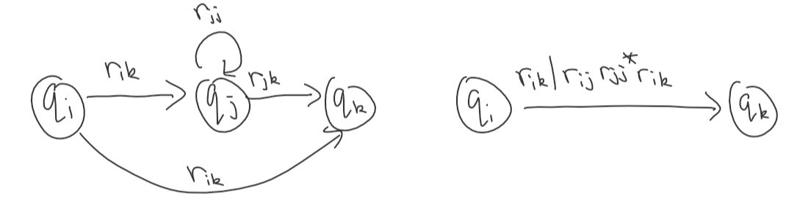

# 2. Regular Expressions

## Patterns

### Atomic

- $\epsilon$ matched by the empty string
- $\emptyset$ matched by nothing
- $?$ matches any symbol in $\Sigma$

### Compound

- $p|q$ matched by string $w$ if $w$ matches $p$ or $q$
- $p\&q$: matches both
- $pq$: if string $w = xy$, $x$ matches $p$ and $y$ matches $q$
- $\bar{p}$: doesn't match $p$
- $[p]$: matches $p$ or if $w$ is an empty string
- $p^*$: zero or more characters
- $p^+$: one or more characters

### Language Definition

$L(r)$ is the language generated by the regular expression $r$.

- $L(a) = \{ a \}$
- $L(\epsilon \} = \{ \epsilon \}$
- $L(\emptyset) = \emptyset$
- $L(p|q) = L(p) \cup L(q)$
- $L(pq) = L(p)L(q)$
- $L(p^*) = L(p)^*$
  - RHS: iterated language operation (concatenating language with itself infinitely many times)

- $(p|q)|r = p|q|r$
- $(pq)r = pqr$
- Order of operations: $*$, concatenation, union

#### Proving Every Language Generated by a Regular Expression is an NFA

Where $a \in \Sigma$:

- $p^+ = pp^*$
- $[p] = p|\epsilon$
- $? = a_1 |a_2 |\dots|a_(n-1) | a_n$

### Finite Automata to RegExp

- Labelled with RegExps as well as symbols from the alphabet (or $\epsilon$)
- One accept state
- At most one transition between states
- No transitions into the start state or out of the end state

Every language accepted by an NFA is generated by a RegExp. We can successively remove states and replace them with longer and longer RegExps as transitions. To remove $q_j$, for all $q_i$ and $q_j$ where $i \neq j$ and $k \neq j$:

### Minimization of DFA

- Eliminate states that can't be reached from the start state
- Find equivalent states
- Collapse equivalent states

Equivalence of states $p$ and $q$:

$$
\hat{\delta}(p, w) \in F \Leftrightarrow \hat{\delta}(q, w) \in F \text{ for each } w \in \Sigma^*
$$

i.e. states are equivalent if, for all strings, if you start at $p$ or $q$ and both reach an accept state (or if both are rejected).

If states are not equivalent, they are distinguishable:

- If one state is accepting and another is not accepting, $\epsilon$ can be passed and they are clearly distinguishable
- If two states $r$ and $s$ are distinguishable by the string $x$, if $\delta (p, a) = r$ and $\delta (q, a) = s$, then this means $p$ and $q$ produce different outputs for the string $w = ax$ so they are also distinguishable

#### Algorithm to find distinguishable states

- Create a table (staircase) of pairs where one is accepting and one is not (i.e. distinguishable)
- For remaining pairs, see what happens under all transitions. If the pair of states you end up in are known to be distinguishable for any transition, then the pair you started with are also distinguishable. If not, no new information is obtained
- Repeat until no new information is obtained

$p \sim q$ if two states are equivalent. The $ \sim $ relation is:

- Reflexive: $p \sim p$
- Symmetric: $p \sim q$ implies $q \sim p$
- Transitive: $p \sim q$ and $q \sim r$ implies $p \sim r$

Thus it is an equivalence relation $\sim \; \subseteq A \times A$:

- $[a] = \{ b \in A:a \sim b \}$ is the equivalence class of $a$
- $a$ is an representative of $[a]$
  - e.g. if $a,b \in [a]$, $[a] = [b]$
- $A/\!\!\sim \; = \{ [a] \mid a \in A \}$ is the quotient of $A$ by $\sim$
  - i.e. the set of all equivalence classes

#### Minimization Algorithm

- Let DFA $M = (Q, \Sigma, \delta, q_0, F)$
- The quotient automation $M' = (Q/\!\!\sim, \Sigma, \delta ', [q_0 ],F' )$
- A state of $M'$ is an equivalence class of $\sim$
- $F' = \{ [q] \mid q \in F \}$
- $\delta':Q/\!\!\sim \times \Sigma \rightarrow Q/\!\!\sim$
  - $\delta' ([q], a) = [\delta(q,a)]$
  - The transition function is well-defined: it doesn't matter which representative of $q$ is chosen

Notes:

- Two minimal DFAs for the same language are identical, except for the names of the states
- Minimization does not work for NFAs

## Decision Problems

Languages $A$ ,$B$, string $x$:

- Membership: $x \in A$?
- Emptiness: $A = \emptyset$?
- Finiteness: $|A| \in N$?
- Universality: $A = \Sigma^*$?
- Intersection Emptiness: $A \cap B = \emptyset$?
- Inclusion: $A \subseteq B$
- Equivalence: $A = B$

### Membership

If the string $x$ is accepted by the language.

Run $M$ with input $x$, check if it's accepting. Linear time in length $x$ and size of $M$.

### Emptiness

If no string is accepted by the language.

Reachability to an accepting state. Use BFS or DFS.

Running time is linear in the size of the input $M$: $O(|Q|+|Q\|\Sigma|)$.

### Finiteness

If the number of strings accepted by the language is finite.

- Check if there is a cycle on path from start state to an accept state
- Remove all states from which accept state is not reachable
- Check if the cycle is still reachable from start state
  - Infinite if this is true

Running time is linear in the size of $M$.

### Universality

If the language accepts all possible strings.

True if and only if $\overline{L(M)} = \emptyset$. Construct the complement DFA by inverting end states; check emptiness.

Running time is linear.

### Intersection Emptiness

True if $L(M) \cap L(M') = \emptyset$.

Reduce the problem to the emptiness problem by constructing the product automaton.

- Constructing product DFA is proportional to $M$ times $M'$: it is quadratic
- Running time is linear in the size of the input: the product automaton, not $M$
- So the running time is quadratic as well

### Inclusion

If $L(M) \subseteq L(M' )$. $L(M) \cap \overline{L(M')} = \emptyset$ if this is the case.

Hence, take the complement of the $M'$ and use the intersection emptiness property. Running time is quadratic.

### Equivalence

Use inclusion property going both ways.

$L(M) = L(M')$ if and only if $L(M) \subseteq L(M')$ and $L(M' ) \subseteq L(M')$.

Running time is quadratic.

## Non-Regular Languages

Not all languages are regular. Counterexample: $A = \{ a^n b^n \mid n \in N \}$.

- In every state, there is exactly one transition for each symbol
- There are finitely many states
- A DFA can accept infinitely long strings
- So there must be a loop
  - Which means its behaviour will repeat

Assume $A$ is a DFA with $k$ states:

- Pass in a string longer than $k$: it must go through $k+1$ states. Assume it is $a^k$
- Therefore it must repeat through one state
- Let $i$ be the number of $a$'s required to get to the repeated states the first time
  - And $j$ the number of $a$'s to get to the repeated state the second time
  - $\hat{\delta}(q_0, a^i) = \hat{\delta}(q_0, a^j)$
  - $\therefore \hat{\delta}(q_0, a^i b^i) = \hat{\delta}(q_0, a^j b^i)$
  - So $a^i b^i$ must be in the language, but $a^j b^i$ can't be in the language
  - So by contradiction, $A$ can't be a DFA

### Pumping Lemma

If $A$ is regular, there is a number $n$ such that every $w \in A$, $|w| \ge n$ can be expressed as $w = xyz$ where:

- $y \neq \epsilon$
- $|xy| \le n$
- $xy^i z \in A$ for every $i \in N$

Three parts: getting to cycle, looping through the cycle $i$ times (or zero times), getting to end state.

To show $A = \{ a^n b^n \mid n \in N \}$ is not regular, first assume it is regular:

Set $w = a^n b^n$. It is clearly longer than $n$, so $w = xyz$ where $y \neq \epsilon$ and $|xy| \le n$.

Therefore $y = a^j$, where $1 \le j \le n$. Let $i = 2$:

Hence, $xy^i z \in A$ by the pumping lemma, but $xy^2 z = xyyz = a^n yb^n = a^{n+j} b^n \notin A$.

## Modelling Independent Processes

Shuffling:

- $x\|y$: insert next character from $x$ or $y$ into output. Returns set of all possible shuffles
- Shuffling languages: every possible shuffle of every combination of two strings (one from each language)

Shuffle of the same language: NFA with $|\Sigma|^2$ states, with transitions going horizontally or vertically, but not diagonally: one symbol can only move it in one of the DFAs. Both are the same, so there is symmetry so the upper or lower triangle can be cut off. The accepts states are the intersection.
