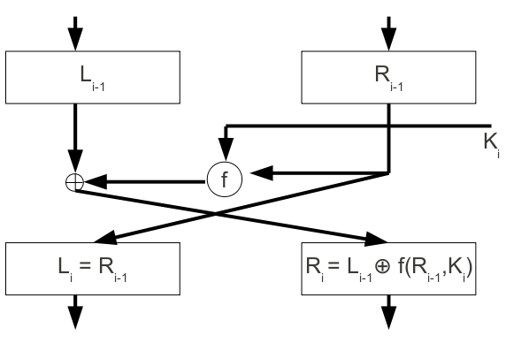

# 05. Block Ciphers

Main bulk encryption algorithms used in commercial applications. AESis one example of such algorithm.

## Principles

Block ciphers are symmetric key ciphers where each block of plaintext encrypted with the **same** key.

A block is a set of plaintext symbols of a fixed size, typically 64 to 256 bits in modern ciphers.

They are used in configurations called *modes of operation*.

### Notation

- $P$: plaintext block of length $n$ bits
- $C$: ciphertext block of length $n$ bits
- $K$: key of length $k$ bits
- Encryption: $C = E(P, K)$
- Decryption: $P = D(C, K)$

### Criteria

*Confusion*: substitution used to make the relationship between $K$ and C$ as complex as possible.

*Diffusion*: transformations used to dissipate the statistical properties of $P$ across $C$.

Repeated use of techniques can be used using the concept of a *product cipher*.

## Product & Iterated Ciphers

### Product Cipher

Cryptosystem where encryption performed by applying/composing several sub-encryption algorithms: output of one block used as input to next block.

Often composed of simple functions $f_i$ for $1 \le i \le r$ such that each $f_i$ has its own key $K_i$.

$$
C = E(P, K) = f_r(\dots(f_2(f_1(P, K_1), K_2)\dots), K_r)
$$

### Iterated Cipher

Special product ciphers called *iterated ciphers* where:

- Encryption divided into $r$ similar *rounds*
- Sub-encryption functions are the same function $g$: the *round function*
- Each *round key*/*subkey* $K_i$ is derived from the master key $K$ using a process called *key schedule*

#### Encryption

Given plaintext block $P$, round function $g$, round keys $K-1, K_2, \dots, K_r$, the ciphertext block $C$ is derived through $r$ rounds:

$$
\begin{aligned}
W_0 &= P \\
W_1 &= g(W_0, K_1) \\
W_2 &= g(W_1, K_2) \\
\dots
W_r &= g(W_{r - 1}, K_r) = C
\end{aligned}
$$

#### Decryption

There must be an inverse function $g^{-1}$ such that $g^{-1}(g(W, K_i), K_i) = W$ for all keys $K_i$ and blocks $W$.

$$
\begin{aligned}
W_r &= C \\
W_{r - 1} &= g^{-1}(W_r, K_r) \\
W_{r - 2} &= g^{-1}(W_{r - 1}, K_{r - 1}) \\
\dots
W_0 &= g^{-1}(W_1, K_r) = P
\end{aligned}
$$

#### Types of Iterated Ciphers

*Substitution-Permutation Network (SPN)* e.g. Advanced Encryption Standard (AES).

*Feistel Cipher* e.g. Data Encryption Standard (DES).

##### Substitution-Permutation Network

Block length $n$ must allow each block to be split into $m$ sub-blocks of length $l$: $n = lm$.

Substitution $\pi_S$ (called substitution box or S-box) operates on sub-blocks of length $l$ bits:

$$
\pi_S: \{ 0, 1 \}^l \rightarrow \{ 0, 1 \}^l
$$

i.e. mapping some binary number of $l$ bits to another.

Permutation $\pi_P$ (called permutation-box or P-box) swaps the inputs from $\{ 1, \dots, n \}$:

$$
\pi_P: \{ 1, \dots, n \} \rightarrow \{ 1, \dots, n \}
$$

i.e. swapping the order of bits in the entire block around.

#### Operation

1. Round key $K_i$ XORed with current state block $W_i$: $K_i \oplus W_i$
2. Each sub-block substituted applying $\pi_S$
3. The whole block permuted using $\pi_P$

#### Example

- 4 round keys
- 4 S-boxes
- 1 P-box
- Last round does have a P-block

#### Feistel Cipher

Round function swaps the two halves of the block to form a new right hand half.

##### Encryption

Plaintext block $P = W_0$ split into two halves $(L_0, R_0)$.

For each round:

- $L_i = R_{i - 1}$
- $R_i = L_{i - 1} \oplus f(R_{i - 1}, K_i)$

The output is the ciphertext block $C = W_R = (L_r, R_r)$.

##### Decryption

Split $C$ into two halves, $(L_r, R_r)$.

For each round:

- $L_{i - 1} = R_i \oplus f(L_i, K_i)$
- $R_{i - 1} = L_i$

$f$ does not need to be inverted: $x \oplus x = 0$, so applying by applying $f$ twice it can be decrypted.

The choice of $f$ is critical for security; is is the only non-linear part of the encryption.
