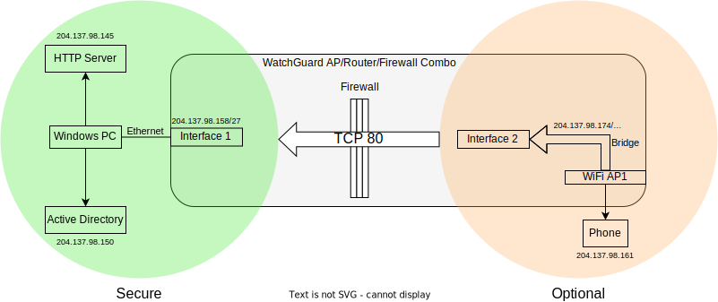
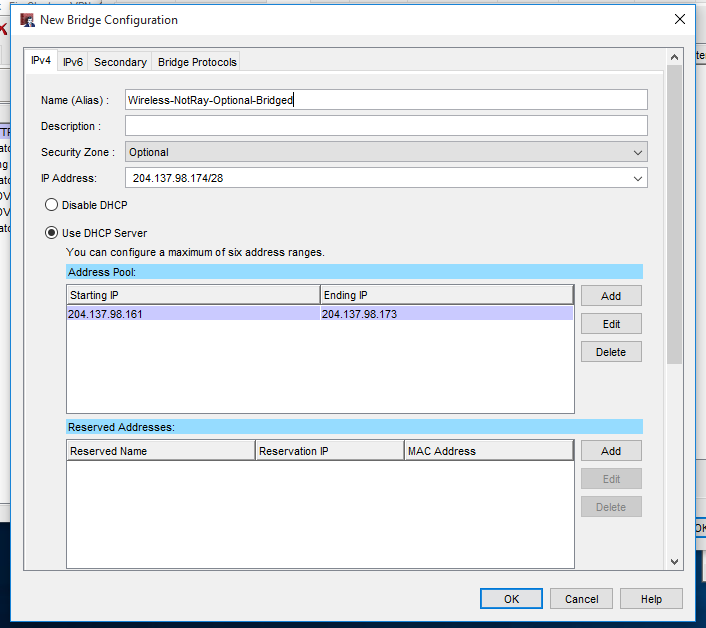

# Lab 01---Wireless Security Infrastructure

## Abstract

This report looks at the state of wireless security infrastructure,
specifically the WPA standards, in both personal and enterprise
environments, and finds them vulnerable to attack, especially for
personal networks. We conclude that wireless security alone should not
be relied upon; instead, traffic should be encrypted at higher levels of
the network stack, such as through HTTPS, to ensure the confidentially
and integrity of data being transmitted over the air and over the local
network. To achieve this, enterprises may wish to implement two-factor
authentication (2FA), reducing the risk of stolen credentials being used
to enter a secure network, and look at zero trust architectures,
stopping the implicit trust in devices based on them being on a local
network.

## Introduction

In today's world, people have many connected devices in their lives; we
carry around smartphones, laptops and smart watches around on our person
and have desktops and internet-of-things (IoT) devices at home. Many of
these will be connected to our home or work network via WiFi, making it
critical for the data flowing through them to stay secure. Businesses
too use wireless devices heavily, with many workers using laptops or
phones to carry out critical work.

Today, the most common protected WiFi standards in use are WPA2-Personal
(WiFi Protected Access II) and WPA2-Enterprise. WPA2-Personal uses a
**p**re-**s**hared **k**ey (PSK); a password shared among all users of
the network, while WPA2-Enterprise uses a RADIUS server and has unique
credentials for each user. This lab does a practical experiment on
cracking WPA2-Personal, and does an analysis of the security of
WPA2-Enterprise.

## Experimental Results

### Personal Networks

Cracking WPA2-PSK secured networks was extremely easy, only requiring a
WiFi card with monitor mode, a Linux computer and proximity to the
network. In this and subsequent labs, the RedHat Linux distribution is
used as it has a large number of security and hacking tools built in.

To do this, the attacker must first determine the channel the target
network is using using `airodump-ng` and then configure their WiFi
card to use monitoring mode for that channel using `airmon-ng`.

After this, `airodump-ng` can be used to log all packets between the
access point (AP) and any client devices. As WPA2's handshake mechanism
does not provide forward secrecy, it is possible for the attacker to
mount a brute-force attack to crack the AP's password using any
captured handshake packets.

*Figure 1: `aircrack-ng` showing cracked password and keys*

In the above screenshot, `aircrack-ng` was used with the *rockyou*
password dictionary to determine the key and transient key, allowing the
attacker to decrypt all traffic for that session or join the network.

Fortunately, a large amount of traffic used on personal networks is to
the internet, which is increasingly running over HTTPS---depending on
the underlying OS, between 80% (Linux) and 99% (ChromeOS) of pages
loaded by Google Chrome are loaded over HTTPS [^1]. Although this will
minimize the impacts to home networks, attackers can still use this as a
foothold for further compromise. For example, if they have IoT devices
or a PC with a server running, they could use the initial access to the
local network to compromise these devices, allowing them to retain
access to the network even when they are not physically present.

The process of cracking the password for the access point passive and
hence, cannot be detected. However, a less patient attacker can use
`aireplay` or some other tool to send a de-authentication packet on a
WiFi card that supports packet injection. Once sent, the victim device
will automatically disconnect and then immediately reconnect, allowing
the handshake to be captured. There exist projects such as Pwnagotchi
[^2] which do this disconnection on all devices it can find
automatically. If done maliciously, an attacker can also use this to
perform a denial-of-service (DoS) attack on all devices in the area.

Although the 802.11w-2009 standard, which is required for Wi-Fi
CERTIFIED WPA3™ [^3] devices (with all WiFi CERTIFIED devices requiring
WPA-3 since June 2020), prevents an attacker from sending valid
de-authentication packets, adoption among consumer routers seems very
low.

WPA3 also provides better security through a new key exchange protocol
called Simultaneous Authentication of Equals (SAE), which provides
forward secrecy and prevents offline attacks. Unfortunately, several
security issues that have already been discovered in WPA3.

Although WPA3 is now becoming available on newer consumer routers, most
routers will likely be in WPA3 transition mode, which allows WPA2
connections with the same password. If an attacker sends beacons
claiming the router only supports WPA2 and spoofs the unauthenticated
first message of the 4-way handshake, the victim will send the
authenticated second message of the handshake. Although the attacker
will be unable to reply as the third message requires authentication,
the second message from the client contains enough information to brute
force the password [^4].

Additionally, [^4] also found that WPA3 is vulnerable to DoS attacks by
sending spoofed handshakes. WPA3's more computationally expensive
handshake can be used to overload the AP's CPU with minimal CPU usage
on the attacker device and minimal airtime, preventing new devices from
being able to connect.

### Wireless Enterprise Networks

In the second part of the lab, a WPA-2 Enterprise network was set up.
The hardware used was a PC acting as an HTTP server, and in the later
part of the experiment, an Active Directory server, a smartphone, and
the WatchGuard XTM33-W [^5], an all-in-one router, WiFi AP and
firewall.

The final network is as shown below:

*Figure 2: diagram of network setup*

The router has three security zones:

- Secure: the internal network, such as internal servers
- Optional: a mixed-trust zone, usually containing servers that should
  be accessible from the internet, and WiFi APs where connected
  devices need access to internal servers
- External: untrusted networks, such as those connecting to the
  internet, and guest networks which should have no access to internal
  servers. This experiment did not use this

*Figure 3: Screenshot showing firewall rules, including the one allowing
TCP port 80 from Any-Optional to Any-Trusted*

Devices on different zones cannot communicate with each other unless a
specific firewall rule is put in place. In this case, the top rule was
added to allow TCP traffic on port 80 originating from any device on the
Optional security zone to any device on the Secure zone to pass through.
Hence, this will allow devices to communicate with HTTP servers on the
Secure zone (but not vice-versa).

*Figure 4: bridge setup*

Next, a bridge in the Optional security zone was set up with DHCP, with
the WiFi AP using this to bridge itself to interface 2. The bridge and
interface 1 (Secure, connected to PC) are set to be on different
subnets.

The AP was configured to use WPA2 Enterprise with EAP-PEAP and
MS-CHAPv2. Initially, the authentication was configured to be through
Firebox-DB---a database of usernames and passwords (and groups) built
into the WatchGuard device that can be managed through their proprietary
configuration software [^5].

However, this will not be ideal in an enterprise environment as it will
not be connected with the rest of their systems, such as user account
management and logging systems. Hence, most enterprise environments will
instead choose to use an external RADIUS server, often through Microsoft
Active Directory. A static password is used to authenticate the AP with
the RADIUS server.

WPA2-Enterprise uses unique login credentials for each user and hence, a
leak of credentials only affects one user, making revoking/changing
credentials much easier. In addition, it provides forward secrecy, with
the RADIUS authentication returning a 256 bit pairwise master key unique
to the current session [^6]. Hence, even if this is brute-forced, the
attacker still does not have their password and can only decrypt that
single session's contents. Contrast this to WPA2 personal where the
contents of any captured session can be decrypted as long as the
handshake is captured.

PEAP-MS-CHAPv2 uses a secure outer TLS tunnel (with the 'P' in PEAP
referring to this protection) to encrypt inner authentication protocol.
This requires the server to have a public key certificate that hopefully
has a chain of trust leading to a trusted root CA---in the case of this
experiment, a self-signed certificate was used.

On operating systems such as macOS and iOS, the first time the user
connects to the network, they must first accept the certificate, giving
the user the opportunity to view the certificate and domain. This
reduces the chance of an evil twin attack as the attacker must either
use a self-signed certificate or register a certificate on their own
domain, and hope that the user will not notice or care.

Using the secure tunnel, MS-CHAPv2 is used to verify that both parties
have access to the hash of the password. The (unsalted) hash must be in
a specific format---NT hash, which may not possible or ideal if Active
Directory is not being used.

The MS-CHAPv2 protocol can be brute forced fairly easily [^7] due to
its use of weak hashing functions such as MD4 and SHA-1 [^8]. Hence,
the security of the outer TLS tunnel is critical; if it is somehow
broken, the user password can be easily extracted.

There are also other EAP methods, although due to the prevalence of
Microsoft systems in business and enterprise systems, MS-CHAPv2 is the
most common protocol. For example, PEAP-EAP-TLS is more secure [^9] as
it requires both the authentication server and connecting device to have
their own certificate. Hence, to successfully infiltrate a network, the
attacker must obtain both the device's private certificate and user
credentials (e.g. from a phishing attack). However, this requires the
organization to create certificates for every device, which is not
feasible in many situations.

Additionally, WPA2 is not invulnerable: in 2017, a vulnerability called
KRACK---key reinstallation attack [^10], was discovered, which worked
on both personal **and enterprise** networks. The attack tricked victim
devices into reusing keys by replaying transmissions during the
handshake, resetting the nonce. As some of the traffic is predicable, a
known-plaintext attack can be carried out to determine the transient
key. Although a dictionary attack would have been easier on personal
networks, this attack worked on enterprise networks and personal
networks with strong passwords.

Although all vendors will have since patched their software, this
vulnerability shows that even enterprise-grade wirelesses have security
issues. Hence, enterprise networks should seek to use encryption on the
higher levels of the network stack, such as the application layer, and
not trust devices solely because they connected to a local network. This
is called a *zero trust architecture*, and standards such as NIST
800-207 [^11] are available which document procedures and practices to
implement this.

Additionally, one significant area of weakness that was not covered in
this lab is people---humans are fallible prone to reusing passwords and
can be fooled into giving up their credentials through social
engineering. If attackers can gain these credentials, they will gain
significant access to the network. Hence, enterprises should also use
2FA wherever possible, significantly increasing the difficulty of being
able to break into a network or tricking employees into giving them
access. This should occur on the application layer, with devices on the
WiFi network being treated as untrusted by default. For example,
hardware 2FA tokens such as Yubikeys or soft tokens such as Google
Authenticator could be used as a second factor to authorize logins into
company-provided laptops or to allow access to internal systems.

## Conclusions

This lab shows that the state of consumer-level WiFi security is very
poor, with attackers being able to trivially crack passwords and cause
denial-of-service attacks, even on routers supporting the newer WPA3
standard. However, enterprise setups have far better security with
user-specific credentials, forwards secrecy, and prevention of evil twin
attacks through the use of trusted certificates.

However, KRACK showed that serious vulnerabilities have existed and may
still exist in WPA2, making it clear that wireless security alone cannot
be trusted. Hence, additional encryption, such as TLS, should be
implemented on top of wireless security protocols. On home networks,
this is less relevant as most traffic goes to the internet, much of
which now uses HTTPS. For enterprise networks, 2FA should also be
implemented wherever possible, reducing the consequences of human errors
through social engineering or credential stuffing attacks. This could be
implemented alongside a zero trust architecture in which no device is
treated as secure by default on the basis of it being connected to the
local network.

[^1]: Google, "HTTPS encryption on the web," 2022-03-12. \[Online\]. Available: https://transparencyreport.google.com/https/overview. \[Accessed 2022-03-25\].

[^2]: "Pwnagotchi," \[Online\]. Available: https://pwnagotchi.ai/. \[Accessed 2022-03-14\].

[^3]: P. Ebbecke, "Protected Management Frames enhance Wi-Fi® network security," Wi-Fi Alliance, 2020-02-25. \[Online\]. Available: https://www.wi-fi.org/beacon/philipp-ebbecke/protected-management-frames-enhance-wi-fi-network-security. \[Accessed 2022-03-02\].

[^4]: M. Vanhoef and E. Ronen, "Dragonblood: Analyzing the Dragonfly Handshake of WPA3 and EAP-pwd," *2020 IEEE Symposium on Security and Privacy (SP),* pp. 517-533, doi:10.1109/SP40000.2020.00031

[^5]: "WatchGuard XTM 33 Wireless Series Next-Generation Firewall," GuardSite, 2012. \[Online\]. Available: https://www.guardsite.com/XTM-33-Wireless.asp. \[Accessed 2022-03-14\].

[^6]: T. Koeman, "Why is WPA Enterprise more secure than WPA2?," 2016-09-23. \[Online\]. Available: https://security.stackexchange.com/a/137606. \[Accessed 2022-03-16\].

[^7]: user173641, "MsChapV2 authentication and Evil Twin attack," 2018-07-12. \[Online\]. Available: https://security.stackexchange.com/a/189441. \[Accessed 2022-03-20\].

[^8]: Microsoft Corporation, "Microsoft PPP CHAP Extensions, Version 2," 2000-01. \[Online\]. Available: https://datatracker.ietf.org/doc/html/rfc2759. \[Accessed 2022-03-10\].

[^9]: D. Kumar, "A crash course into WPA Enterprise security and deployment," Context Information Security, 2020-05-04. \[Online\]. Available: https://www.contextis.com/en/blog/a-crash-course-into-wpa-enterprise-security-and-deployment. \[Accessed 2022-03-16\].

[^10]: M. Vanhoef and F. Piessens, "Key Reinstallation Attacks: Forcing Nonce Reuse in WPA2," *2017 ACM SIGSAC Conference on Computer and Communications Security,* pp. 1313-1328, https://doi.org/10.1145/3133956.3134027

[^11]: S. Rose, O. Borchert, S. Mitchell and S. Connelly, "NIST Special Publication 800-207: Zero Trust Architecture," doi:10.6028/NIST.SP.800-207

<!--
TODO does WPA2 enterprise use 4 way handshake

https://giuliocomi.blogspot.com/2018/06/wpa2-psk-vs-wpa2-enterprise-hacking-and.html

https://wifiwarrior.com/2017/04/22/wpa2-enterprise-802-1xeap-authentication-process/

### WPA2-Personal 4-Way Handshake

Keys:

\- **P**airwise **m**aster **k**ey, or PMK, is a 256-bit key derived
solely from the PSK.

\- **G**roup **m**aster **k**ey, or GMK - TODO

\- **P**airwise **t**ransit **k**ey, or PTK, is the key used to encrypt
unicast traffic

\- **G**roup **t**emporal **k**ey, or GTK, is the key used to encrypt
broadcast and multicast traffic from the access point

The device attempting to connecting to the access point is called the
*supplicant* and generates a nonce; the *SNonce*. Its MAC address is
called the *SA*.

The access point's MAC address is called the *AA*, and it also
generates a nonce; the *ANonce*.

The PTK is a hash of the concatenation of the PMK, ANonce, SNonce, AA,
and SA.

Handshake:

1.  The access point sends a nonce---the ANonce

2.  The supplicant calculates the PTK, and sends its SNonce and its
    **m**essage **i**ntegrity **c**ode (MIC)

3.  The access point calculates the PTK, and sends the GTK with its MIC.
    This message is encrypted with the PTK TODO CHECK

4.  The supplicant sends an acknowledgement message

https://westoahu.hawaii.edu/cyber/forensics-weekly-executive-summmaries/taking-advantage-of-the-4-way-handshake/

https://praneethwifi.in/2019/11/09/4-way-hand-shake-keys-generation-and-mic-verification/

https://hashcat.net/forum/thread-7717-post-41447.html

(https://www.sciencedirect.com/science/article/pii/S221421262100243X)?
maybe another

\<!\--

WPA2: https://www.krackattacks.com

https://www.zdnet.com/article/understanding-the-updated-wpa-and-wpa2-standards/

https://www.wi-fi.org/knowledge-center/faq/what-are-protected-management-frames

https://en.wikipedia.org/wiki/IEEE_802.11w-2009

\--\>

Network identifier: host bits all zero.

Broadcast IP: host bits all one.

\<!\--

WPA2 Enterprise: new key for each session = only one session affected

https://security.stackexchange.com/questions/29602/is-it-possible-to-use-the-aircrack-ng-tool-to-crack-a-wpa2-enterprise-network

https://security.stackexchange.com/questions/46670/does-using-wpa2-enterprise-just-change-the-attack-model-vs-wpa2-psk

https://security.stackexchange.com/questions/35780/why-is-wpa-enterprise-more-secure-than-wpa2

https://wifininjas.net/2019/08/23/wn-blog-012-can-you-crack-802-1x-wpa2-enterprise-wireless-data/

Active Directory

Trusted Router Optional WAP Phone

Admin Computer

Traffic:

Optional \-- TCP 80 -\> Trusted

Authentication

Phone \-- EAPOL - Router \-- RADIUS -\> AD

WPA Personal: PSK - Pre-Shared Key

EAP: Extensible Authentication Protocol

EAPOL: EAP Over Lan

PEAP: Protected EAP

MS-CHAPv2: Microsoft Challenge Authentication Protocol V2

Server pushes public key certificate to client; (hopefully) indirectly
signed by root CA. User can view domain name to verify it matches what
is expected, preventing evil twin attacks.

https://www.contextis.com/en/blog/a-crash-course-into-wpa-enterprise-security-and-deployment

EAP-TLS: both parties have certificates. Hence, even if credentials
leaked, private certificate is still stored safely on device.

EAP assumes trusted communication channel, which wireless networks do
not provide. PEAP uses TLS to create secure outer tunnel - hence, server
needs to have a certificate.

PEAP-MS-CHAPv2

https://sensepost.com/blog/2019/understanding-peap-in-depth/

Unique login credentials for each user, so only need to change one
user's credentials if breached.

\--\>

-->
