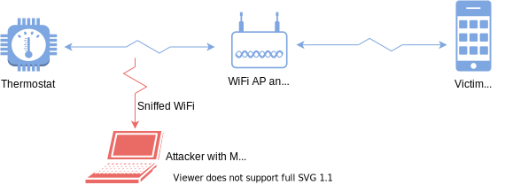
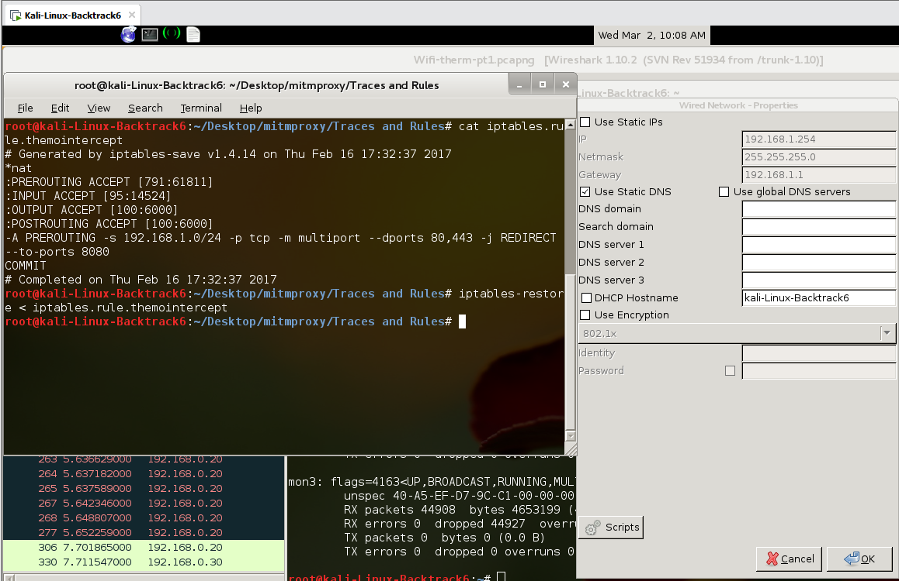
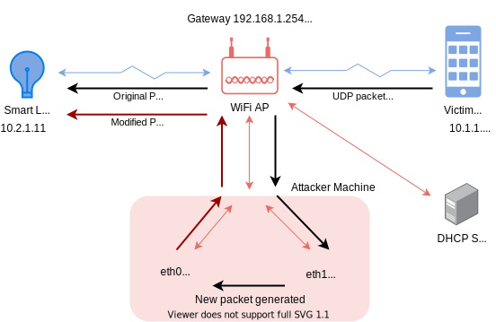
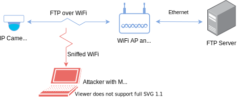
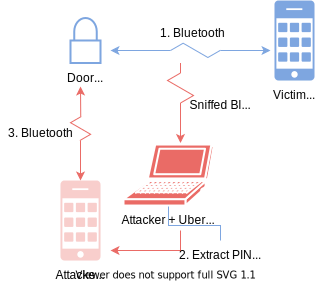
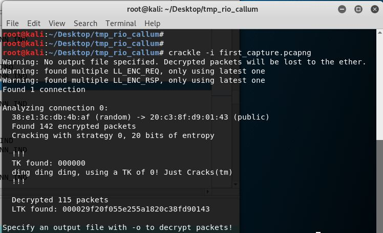

# Lab 02---Internet of Things

## Abstract

Connected devices are becoming more common in our lives, allowing data
from sensors to be streamed and actuators to be controlled remotely,
streamlining both our personal lives and business operations. However,
these devices are often insecure by default, set up by the factory
to not use any encryption or use easily guessable, factory-set
credentials, relying mostly on the security of the underlying network
for protection. In addition, IoT devices often use outdated and
unpatched software, with the manufacturer often not supporting them or
possibly having gone out of business.

These factors lead to IoT devices being used by attackers as an entry
point into a network, silently siphoning unencrypted data to gain a
better understanding or the site and then taking control of vulnerable
devices to spread to other devices on the local network. Due to these
insecurities, people and administrators should take care to configure
devices for security and, if possible, segment their network so that IoT
devices are partitioned from the rest of the network, limiting the
spread of any infection. This could be done via a set of strict firewall
rules or a separate VLAN, with two-factor authentication being used to
authenticate any user who wishes to connect to critical IoT LANs.

## Introduction

The Internet of Things provides homes and businesses with the ability to
remotely monitor and control sites. For homes, this may include smart
lights or thermostats which reduce friction in our lives, but for
businesses, this may include things such as cameras, medical devices, or
industrial control equipment.

This report looks at vulnerabilities in several different devices to
show how an attacker can sniff traffic from the device, modify valid
commands or send rouge commands. Four devices are covered: a smart
thermostat, smart light, IP webcam and a door lock, which used three
different protocols: UDP, TCP and Bluetooth. Additionally, the report
looks at the consequences of these vulnerabilities in a wider scope,
describing possible consequences to serious business operations and
mitigations.

## Experimental Results

### Smart Thermostat

The CT Wireless Thermostat [^1] is a WiFi-enabled HVAC controller. The
thermostat has an open and documented API that runs over HTTP (not
HTTPS).

The API also leaves the thermostat wide open in another sense of the
word, requiring absolutely no authentication and hence allowing any
device connected to the local network full control over its operations.
In commemoration of this, CVE-2013-4860 [^2] was created. This
vulnerability means that the thermostat is blindly trusting that any
device on the network is secure and trusted, and that the users of the
devices cannot be tricked.

In the thermostat, one of the consequences of the lack of authentication
is that any device on the local network can send requests, even
inadvertently. For example, if an attacker knows the local IP address of
the thermostat, they can use a DNS rebinding attack to send commands to
the device remotely [^3]. As CORS---cross origin resource protection,
stops JavaScript from making HTTP requests to other domains, an attacker
must set up a subdomain on a domain they control to point to the
thermostat's local IP address. Once done, the attacker can send a link
to the user on the domain which, when loaded, executes JavaScript that
sends malicious network requests to the thermostat. Note that this does
not require the user's phone or computer to be vulnerable; this is
purely a social engineering attack allowed by the thermostat's lack of
authentication.

A mitigation of this attack could be achieved by putting IoT devices on
a separate VLAN (or separate subnet and blocking all traffic by
default), but most home users are likely to not know even where to
begin, and many businesses do not do this either. [^4] found that 72%
of healthcare VLANs mixed IoT and IT devices, giving attackers an easy
way to penetrate deeper into the network. Due to the prevalence of
outdated systems and the critical nature of healthcare, attackers
targeting this industry have the power to cause significant financial
and personal harm, whether through denial-of-service or ransomware.

Devices should be secure by default [^5], for most people never change
settings from their defaults [^6], and even businesses can fail to
implement basic security measures. As IoT devices become more common in
homes and into the hands of less technically knowledgeable users and
becomes ever more critical to business operations, the consequences of
insecure defaults become greater and greater. For example, many IP
cameras come with factory-set default passwords, allowing websites such
as [insecam.org](http://www.insecam.org/) [^7] to index thousands of
cameras from around the world, including those in sensitive locations
such as baby cribs and military installations [^8].

Even if an IoT device is unimportant and has no consequence to the owner
if hacked or taken offline, it can still have impacts on the world. For
example, the Mirai botnet [^9] infected over 600,000 IoT devices and
used this to launch massive distributed denial-of-service (DDOS)
attacks, with a peak traffic nearing a terabit per second. This was used
to launch several attacks on websites and DNS providers, bringing down
several high-profile websites.

However, the danger is not just attackers moving from IoT systems to
internal networks; the other is also true, with one example being the
Kemuri water company hack [^10]. The company had outdated
external-facing systems which allowed attackers initial entry into the
business network. As their SCADA systems were on the same system, this
same access allowed attackers to modify programmable logic controllers
that controlled chemical and water flow in their water treatment
facility. At this point, they could have impacted the water of hundreds
of thousands of people.

Hence, systems should be partitioned such that it can only be accessed
by authorized users, preferably using two-factor authentication to
reduce the likelihood of a successful phishing or leaked credentials
attack. Although this is unnecessary and far too complex for home
systems that control lights and similar devices, for business systems
controlling critical hardware such as SCADA systems, this should be the
bare minimum.

#### Part 1: Sniffing



*Figure 1: Diagram of sniffing setup*

The setup for this experiment was simple: the thermostat and an Android
phone with a thermostat control app are connected to the same subnet
over WiFi. An attacker is in proximity to the thermostat with a Kali
Linux-based computer with a Raspberry Pi WiPi network adapter. Any WiFi
card that supports monitor mode and packet injection can be used.

WPA2 encrypts traffic for each session with a unique pairwise transit
key (PTK), so to decrypt traffic from the target phone, it is necessary
to capture the 4-way handshake. This can be done by either waiting for
the phone to connect or by forcing the phone to disconnect using a tool
such as `aireplay`.

In this experiment, Wireshark was used for packet sniffing as it has
built-in support for WPA decryption (IEEE802.11). This step also assumes
that the pre-shared key (PSK)---the password for the WiFi network, is
known. As this was shown previously in Lab 1, this experiment was done
under the assumption that the attacker already knows the password.

At this stage, the attacker can easily observe any HTTP traffic sent by
the victim phone. Hence, even if the device they are targeting is
unknown by the attacker or has an undocumented API, they may be able to
reverse-engineer it by passively observing the traffic. Additionally, if
the API requires authentication, such as through HTTP basic
authentication or through an API token in the request header, the
attacker will be able to view and use these to send malicious commands.


*Figure 2: Screenshot of Wireshark showing packet sent by phone setting
thermostat temperature*

#### Part 2: Proxying

By the end of part 1, the attacker has everything they need to send
malicious commands. However, seeing the thermostat change temperature on
its own may alert the user and hence, they may also take a more subtle
approach by *modifying* traffic between the victim's phone and
thermostat and giving the victim false information on the state of the
thermostat.

This type of attack was used in the hugely damaging Stuxnet virus which
attacked Iran's nuclear centrifuges, which replaced drivers and
libraries so that it could send commands to the programmable logic
controllers (PLC) while also hiding this activity from the rest of
system [^11].


* Figure 3: Diagram of MITM setup showing how packets travel through the
attacker machine. As this is TCP, the communications is two-way but to
avoid cluttering the diagram, it is only showing the traffic flow from
the phone to the thermostat*

In order carry out this modification, the attacker must take a more
active role in the network, acting as a man-in-the-middle between the
thermostat and phone. In the case of this experiment, this was done by
putting the phone (DHCP) and thermostat (static IP) on two different
subnets while the attacker device (connected to the router via ethernet
for reliability) was on both subnets.

DHCP was configured to set the default gateway to that of the attacker
(on the same subnet as the phone). If the phone and thermostat were on
the same subnet, they would be able to use ARP to determine the MAC
address and directly communicate with each other. However, because they
are on different subnets, the gateway---the attacker device, can route
packets between the two and hence has the opportunity to intercept,
block, or modify this traffic.

As it is acting as the gateway, it needs to be on both subnets
simultaneously---otherwise, it would not be able to communicate with
either the phone or thermostat. This was achieved using IP aliasing,
which allows a single physical interface to act as multiple virtual
interfaces.


*Figure 4: Virtual IP configuration*

`iptables` was then used to redirect TCP traffic coming from the
target device to port 8080 on the target device. This is required to set
up `mitmproxy` in transparent mode, which allows the proxy to work
without requiring the target phone to be configured.



*Figure 5: `iptables` setup*

In the below example, `mitmproxy` was used to intercept increase the
temperature sent to the thermostat by 10 degrees. Hence, when the phone
sent a POST request to set the temperature to 80 degrees, the thermostat
received a POST request to set it to 90 degrees.


*Figure 6: Photo showing phone and thermostat target temperatures*

Although this experiment required control over the access point and
routing configuration, this could also be achieved using an evil twin
attack, where the attacker masquerades as an access point. If the signal
is stronger than that of the real access point and the attacker can
force a disconnect, the phone will connect to it. The attacker could
then use a secondary network adapter connected to the real access point
to transparently proxy traffic.

### Smart Lights

Smart lights are becoming increasingly common as technology improves and
becomes cheaper, with hundreds of companies making their own smart
lights. The bulb used in this experiment is made by Lifx, who provides
an Android app which allows the user to control the bulb's brightness
and color over WiFi. The company also provides documentation for the
API, with an HTTP API for remote control and a UDP API for local
control. The remote API requires authentication, but the local one does
not.

The set up for this experiment is similar to the thermostat; the phone
and light are on separate subnets, and the attacker is on both via
ethernet. However, this experiment also has a second server configured
to be the DHCP server, mostly for the purpose of ensuring the IP
addresses were consistent between labs. The smart light and victim phone
were on different subnets, but this does not need to be the case. Hence,
the access point does not need to be under the control of the attacker.



*Figure 7: Diagram showing network setup and packet flow. The packet is a
broadcast packet, so it is sent to every device on the network
(including the DHCP server, but this is not shown)*

The Lifx UDP API [^12] uses UDP broadcast messages instead of unicast
messages, allowing a single command to control multiple lights. This
also means that although the attacker can receive the packets, they
cannot stop the UDP packet from reaching the smart light. As a work
around, the captured packet can be modified and then immediately sent
afterwards.

For example, the command below looks for packets originating from the
phone with the correct length for a packet that changes the light color.
It then takes the first 237 bytes, which contains information such as
the message size, light MAC address etc., but not the light color. It
then concatenates this first section of the packet with the contents of
the file `colourstring`, removes the newline added by `cat`, and
then injects the modified packet through interface 1, which is on the
same subnet as the light.

```
hexinject -s -i eth0 -c 1 -f 'src host 10.1.1.9 && udp && len == 91' \|
cut -b 1-237 \|
cat -- colourstring \|
tr -d '\n' \|
hexinject --p -i eth1
```

Hence, the light color will switch momentarily to what the user selected
before returning to the color defined in the `colourstring` file.

Additionally, packets can be saved and then sent out later, even when
the victim device is no longer on the network. Although this is not as
subtle as the previous attack, this can be easily exploited to cause a
denial-of-service. For example, assuming that `/tmp/off` is a packet
captured when the victim turned the light off, the following bash
script:

```
while :; do sleep 0.5; cat /tmp/off | hexinject -p -i eth1; done
```

sends a command to turn off the light every half a second. The first
example given only affects specific packets, while this script will
override any command, hence causing a denial-of-service attack. As long
as the attacker is on the network, any command sent by the user will be
quickly overridden, stopping them from using their phone.

Hence, to prevent against this, two options are possible: the attacker
can be prevented from joining the network, or at least the VLAN the
light is on, or application-layer security could be added, ensuring only
authorized users can control the light. The latter will also require a
timestamp or similar mechanism to prevent replay attacks; otherwise,
although the first command which modifies the packets will fail, the
second command will be unaffected as it is capture of an authenticated
and unmodified packet.

### IP Cameras

IP cameras are a valuable target for attackers as it gives them insight
into the physical state of a target site which they can use for future
intrusion. For example, they could use it to determine blind spots in
the surveillance system, personnel movements, or to monitor the state of
other devices they have infiltrating.



*Figure 8: Diagram of experimental setup*

This experimental setup used an IP camera that was streaming image
frames wirelessly to a server over FTP. The access point used no
password to make things easier for the experiment. However, Lab 1 and
the thermostat experiment described above showed how the PSK can be
easily cracked and how Wireshark can decrypt traffic given the PSK and
the four-way handshake. An attacker can easily send a disconnect request
with `aireplay-ng` and then capture the resulting packets to achieve
both pre-requisites.

Similar to lab 1, the initial steps are:

- Kill the DHCP client to prevent unnecessary traffic and automatic
  configuration
- Determine the target access point BSSID and channel with
  `airodump-ng`
- Place the wireless card on monitor mode using `airmon-ng`, using
  the channel determined in the previous step
- Run an injection test to ensure the capture is working using
  `aireplay-ng -9`, using the BSSID discovered previously


*Figure 9: Wireshark screenshot showing captured FTP packets*

Then, Wireshark can be used to passively capture traffic going through
the router. FTP and FTP data packets can be observed. The images span
multiple packets, so Wireshark's 'Follow TCP Stream' option is used
to capture the full content of the image:


*Figure 10: Image captured passively by Wireshark*

The webcam also runs an HTTP server and its website also has live stream
feature. Like with the FTP traffic, the HTTP packets containing the
image can also be captured, although the presence of headers makes this
more annoying.

As the attacker is listening passively, it is common for capture errors,
such as entire segments being missed, to occur---the attacker cannot ask
for a TCP re-transmission if packets are missed. Captures are more
likely to be successful in un-congested environments where the target
device is close by and is using an older and hence slower networking
protocol such as 802.11a. Additionally, smaller images are more likely
to be successful as fewer packets need to be captured.

Like in Lab 1, this experiment shows the importance of having
application-layer encryption and authentication rather than relying
solely on the security of the link-layer which, under common
circumstances, can be broken completely passively by an attacker with
patience and physical proximity. Although the camera used in this
experiment [^13] provides security by default, forcing the user to set
an administration password on first setup, this is not the case with may
IoT devices. [^4] found that 98% of IoT traffic was unencrypted,
allowing attackers to gain insight into the physical state of the site
and use this information for further infiltration.

### IoT Door lock

The other three experiments showed how relying solely on the security of
the WiFi and the local network leaves devices vulnerable to attack.
However, other wireless protocols, such as Bluetooth, are also
vulnerable to attacks.

This experiment uses a SafeTech QuickLock BTLE door lock paired with an
Android phone with a compatible app, and Ubertooth One Bluetooth [^14]
sniffer connected to an attacker machine running Linux.

The lock has a PIN code that can be shared between users so that
multiple people can use the door lock. During setup, a compatible app,
such as SafeTech and Quicklock, pairs the phone with the lock, and then
requests the user to enter a PIN. If entered correctly, the app will
then be able to lock and unlock the smart lock.

However, if the initial encrypted BTLE connection can be cracked, the
attacker will be able to see the PIN being sent and then use this to set
up their own phone to control the lock. Needless to say, if this is
done, this vulnerability has severe ramifications on people's safety and
security and may make the lock worse than useless by providing them with
a false sense of security.



*Figure 11: Diagram of capture process*

After configuring Wireshark to ingest data from the `ubertooth-btle`
pipe as Bluetooth traffic, the data from the Ubertooth could be captured
and saved to a pcap file. After doing the initial setup of the victim
phone with the lock with the capture running, the traffic could then be
cracked using crackle [^15], a BLE encryption cracker.



*Figure 12: Crackle output*

Bluetooth LE has a 'Just Works' pairing mode. In legacy mode, a
temporary key (TK) of `0` is used to derive a short-term key (STK)
which is then used to derive the long-term key (LTK) that is used for
all future connections [^16]. Hence, an attacker can easily determine
the LTK given the initial connection.

This mode is common in devices which have no screens or other output
device, and this provides no authentication and encryption that can be
easily broken if the initial pairing process is sniffed. Hence,
manufacturers are expected to add their own application-layer encryption
protocol, something that many manufacturers, including Quicklock, do not
do.

With the link-layer encryption broken, the decrypted packet capture can
be opened up in Wireshark, and the ATT (Bluetooth Attribute Protocol)
write request can be found. Within one of these, the default PIN for the
door lock can be found.


*Figure 13: Wireshark screenshot showing the padded default PIN of
'12345678'*

Fixing this vulnerability requires both the lock and the app to be
updated; something that is unlikely to happen considering that their
website copyright header still says 2016 and the SafeTech Android app
has not been updated since 2017. This is one of the other major problems
with IoT; often, devices are released but the software is never updated,
leaving insecure devices insecure, or secure devices becoming insecure
as new vulnerabilities are discovered. Software requires constant
maintenance, but the manufacturer's software support for the devices
they sell are often short or non-existent, and the devices they sell can
sometimes outlast the company.

Part of the reason for this is cost; software maintenance and operations
is expensive, but the consumer IoT space is very competitive, leaving
companies without the necessary time or profit margins to build and
maintain secure software. Hence, businesses looking for IoT solutions
should look at higher-cost, business-focused products from reputable
companies. Subscription services should also be expected as this gives
the manufacturer recurring income, giving them incentive to keep their
products secure years after they are sold and confidence that the
companies will not go out of business.

## Conclusions

The Internet of things allows consumers to reduce friction in their
homes and businesses to streamline operations, but it is also a point of
vulnerability into homes and businesses. Unencrypted traffic, which
makes up the majority of IoT traffic, can be sniffed and potentially
allow attackers to view sensitive information. Unauthenticated endpoints
allow attackers to control IoT devices, and vulnerabilities can be used
to launch further attacks into the network or add them to botnets that
can bring down some of the biggest websites in the world.

Hence, if IoT devices are in homes or businesses, they should all
ideally be secure by default, using application-layer encryption and
authentication to protect endpoints. This reduces the chance of
unconfigured or misconfigured devices being used as entry points into
the network, looking for vulnerable devices or sniffing unencrypted (on
the application-layer) traffic from other, non-IoT devices.

In addition, long-term software support is a must, which will likely
mean avoiding low-cost, consumer-focused solutions and paying a
subscription for long-term support. IoT devices should also be placed on
separate VLANS, or at least have strict firewall rules to prevent
traffic between groups, reducing the spread of infection between
systems. Two-factor authentication should be used to prevent leaked
credentials from being used to access critical IoT systems.

[^1]: Radio Thermostat, "CT50 Wi-Fi Smart Thermostat," 2017. \[Online\]. Available: https://www.radiothermostat.com/product-page/ct50-wi-fi-smart-thermostat. \[Accessed 2022-03-25\].

[^2]: Information Technology Laboratory, "NVD - CVE-2013-4860," 2014-05-06. \[Online\]. Available: https://nvd.nist.gov/vuln/detail/CVE-2013-4860. \[Accessed 2020-03-23\].

[^3]: B. Dorsey, "Radio Thermostat REST API," 2018-04-02. \[Online\]. Available: https://github.com/brannondorsey/radio-thermostat. \[Accessed 2022-03-22\].

[^4]: Unit 42, "2020 Unit 42 IoT Threat Report," Palo Alto Networks, Santa Clara, 2020.

[^5]: National Cyber Security Center, "Secure by Default," 2018-03-07. \[Online\]. Available: https://www.ncsc.gov.uk/information/secure-default. \[Accessed 2022-03-23\].

[^6]: J. Spool, "Do users change their settings?," 2011-09-14. \[Online\]. Available: https://archive.uie.com/brainsparks/2011/09/14/do-users-change-their-settings/. \[Accessed 2022-03-19\].

[^7]: "Insecam," \[Online\]. Available: http://www.insecam.org. \[Accessed 2020-03-29\].

[^8]: Smith, "Peeping into 73,000 unsecured security cameras thanks to default passwords," 06 11 2014. \[Online\]. Available: https://www.csoonline.com/article/2844283/peeping-into-73-000-unsecured-security-cameras-thanks-to-default-passwords.html.  \[Accessed 30 03 2022\].

[^9]: E. Bursztein, "Inside Mirai the infamous IoT Botnet: A Retrospective Analysis," 2017-12. \[Online\]. Available: https://elie.net/blog/security/inside-mirai-the-infamous-iot-botnet-a-retrospective-analysis/. \[Accessed 2022-03-28\].

[^10]: E. Kovacs, "Attackers Alter Water Treatment Systems in Utility Hack: Report," Security Week, 2016-03-22. \[Online\].  Available: https://www.securityweek.com/attackers-alter-water-treatment-systems-utility-hack-report. \[Accessed 2022-04-03\].

[^11]: E. Byres, A. Ginter and J. Langill, "How Stuxnet Spreads -- A Study of Infection Paths in Best Practice Systems," Tofino Security, Abterra Technologies, SCADAhacker.com, 2011.

[^12]: Lifx, "Communicating with a device," 2021. \[Online\]. Available: https://lan.developer.lifx.com/docs/communicating-with-device. \[Accessed 2022-04-03\].

[^13]: "AXIS 207 Network Camera User's Manual," Axis Communications, 2006. \[Online\]. Available: https://www.axis.com/files/sales/25384r6.pdf. \[Accessed 2022-02-30\].

[^14]: "Ubertooth One," Great Scott Gadgets, 2011. \[Online\]. Available: https://greatscottgadgets.com/ubertoothone/. \[Accessed 2022-03-24\].

[^15]: M. Ryan, "Crackle," 2020-12-13. \[Online\]. Available: https://github.com/mikeryan/crackle. \[Accessed 2022-03-14\].

[^16]: K. Lounis and M. Zulkernine, "Bluetooth Low Energy Makes "Just Works" Not Work," *2019 3rd Cyber Security in Networking Conference (CSNet),* pp. 99-106, doi:10.1109/CSNet47905.2019.9108931, 2019.
