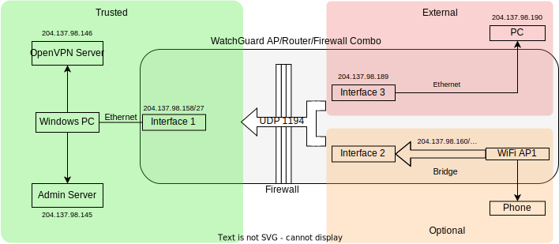
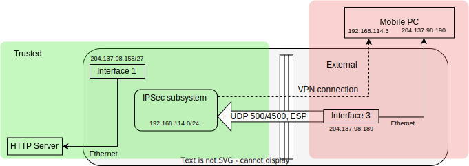
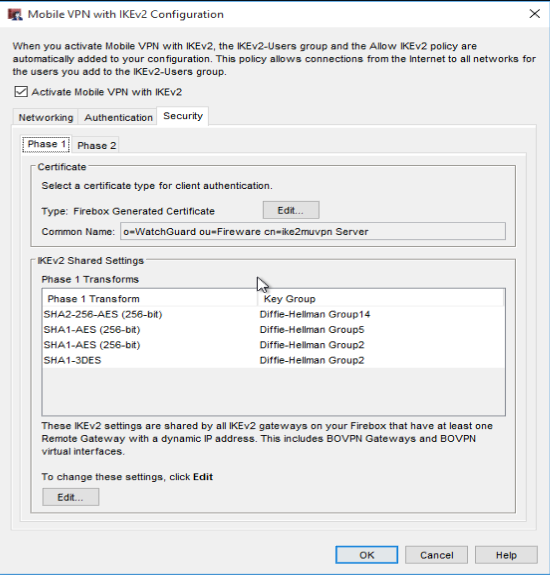
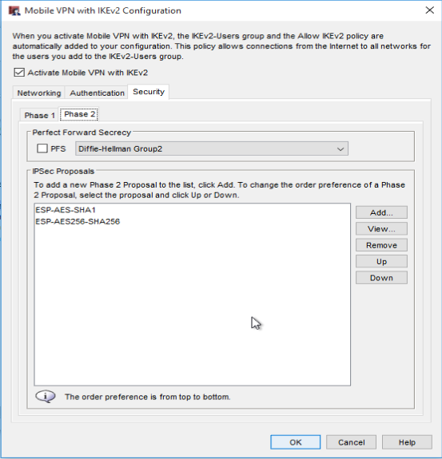

# Lab 03---Virtual Private Networks

## Abstract

Virtual private networks (VPNs) are becoming increasingly necessary in
today's world, with many staff working out of the office, either for
business travel or for remote work. Several solutions are available,
including open-source solutions such as OpenVPN and Wireguard and
standardized protocols such as IKEv2. They offer differing levels of
built-in client support, but as no native options support two-factor
authentication (2FA) well, client-side VPN software will almost
certainly be required.

When considering a VPN, businesses should look to see if the hardware
they have now has software support for any modern VPN protocols (e.g.
not PPTP), or if potential solutions will integrate well with the
existing organization. For example, buying hardware from the same
vendors, those you have support contracts with, or those with which the
staff have experience with. Networks are complex and so choosing the
right hardware can reduce setup time and the chance of misconfigurations
leading to network outages or security vulnerabilities. Additional
considerations when selecting a VPN will be the number of simultaneous
connections it must support---for high connection counts, dedicated VPN
hardware will likely have far better hardware cryptography acceleration
support compared to standard servers.

However, while VPNs extend the local network past the physical
boundaries of the office, they also greatly increase the attack surface
and present themselves as a valuable target for attackers looking to
penetrate the network. Hence, 2FA should almost certainly be used, and
network administrators should, if they are not already doing so,
carefully monitor the network for any signs of intrusion. The economic
and reputational cost of cyberattacks is far too high to take lightly
and will only grow over time.

## Introduction

Virtual private networks, or VPNs, are a common way of extending a
secured local area network over an insecure channel such as the
internet.

Several VPN architectures exist, mostly resolving around where the
tunneling occurs. For example, in a branch office scenario where two
offices networks are being connected, the routers/firewalls would be
responsible for tunneling any traffic going between offices. However, if
you want to secure a mobile device, a point-to-site configuration must
be used, with the mobile device being responsible for the tunneling its
own traffic. Hence, each mobile device must be individually configured
to do this tunneling. This lab looks only at the latter architecture.

Additionally, many VPN protocols exist, running at varying levels of the
network/OSI stack and offering different security levels, speed, and
device compatibility. In this lab, we set up two different point-to-site
VPNs: OpenVPN running on a stripped-down Debian server and a IKEv2 VPN
running on a WatchGuard XTM33-W [^1].

## Experimental Results

### OpenVPN

OpenVPN is open source VPN project which uses OpenSSL and TLS for
encryption. It runs over UDP or TCP (although the latter is vulnerable
to a TCP meltdown and hence not recommended) which allows it to bypass
firewalls in many environments. OpenSSL supports hardware-accelerated
encryption in many setups---the default cipher in recent versions of
OpenVPN, AES-256-GCM [^2], can be accelerated by AES-NI instructions
[^3] which is supported by most modern CPUs.

OpenVPN can be configured in either NAT or routing mode [^4]. In NAT
mode, the server modifies the source IP address of the packets to its
own IP and picks a random port before forwarding it to the destination.
Hence, traffic from all VPN devices appear to originate from a single IP
address from the perspective of the local network, preventing local
devices from initiating communication with the VPN devices. This
downside is not present in routing mode, in which the VPN server
forwards packets. However, the network must be configured to route
outgoing packets through the VPN server.



*Figure 1: Diagram of network setup under OpenVPN [^footnote1]*

OpenVPN supports both TUN and TAP [^5]. The former is a layer 3 IP
tunnel and is supported on Android/iOS devices, while the latter is a
layer 2 Ethernet tunnel which allows two physically separate ethernet
networks to be bridged.

The default topology in OpenVPN for older Windows clients is `net30`
[^6], which creates a virtual /30 subnet for each device. Hence, when
running, the user will see that OpenVPN has created a new virtual
ethernet adapter with a `255.255.255.252` subnet mask. The first IP is
the network address; the second is the virtual IP for the OpenVPN
server, through which traffic gets routed to; the third is the client
address, and the fourth is the broadcast address [^7]. This obviously
consumes more IP addresses than necessary, so the newer, recommended
topology, `subnet`, instead assigns each device its own IP address.


*Figure 2: Screenshot showing new OpenVPN user being created*

Figure 2 shows the OpenVPN CLI being used to add a new user, `Callum`.
This creates an `.opvn` configuration file containing [^8] the public
key of the certificate authority (CA), TLS auth key [^9] (which
authenticates the TLS *handshake* [^10] and hence prevents attackers
from even initiating the handshake), and the public and private keys for
the user profile (which are signed by the CA). These are used to
negotiate a symmetric key on connection initialization. OpenVPN also
supports the use of a static key [^10], although this does not offer
any forward secrecy.

Note that the configuration file protects the key with the static
password. However, OpenVPN can also be configured to require a username
and password that is transmitted to the server, allowing multiple users
to use the same configuration file [^footnote2]. The former case is
slightly more secure as it requires both the private key stored in the
file and the password, but unlike OTP tokens, it is less likely to be
transferred or stored securely, and cannot compare to the security offered
by hardware tokens. Hence, businesses looking to use OpenVPN should look
at setting up a system requiring user credentials and a second factor.
This will likely be linked to the centralized user management system,
such as Active Directory, through RADIUS, and use some third-party
solution such as RSA SecurID for token management.

The `remote` key was modified to match the IP address of the server.
The WatchGuard firewall was configured to allow UDP traffic over the
WireGuard port, port 1194, through, and hence, clients on the external
or untrusted network can establish a connection to the VPN server.

The configuration file was transferred over to the client PC with the
OpenVPN client installed, and the connection was established. Figure 3
shows the /30 subnet described previously, which OpenVPN has put on the
10.0.0.0/8 IANA-designated private-only subnet.


*Figure 3: Screenshot showing virtual TAP adapter enabled on the Windows
client*


*Figure 4: Screenshot showing OpenVPN running on an Android phone*

The same profile was later transferred to an Android phone with the
OpenVPN app installed. The phone was connected to the network setup over
WiFi. Like with the Windows PC, the OpenVPN connection allowed all
traffic to be piped through into the secure area of the network, giving
them more access that what they could get from the optional or external
areas.

### IKEv2 on WatchGuard



*Figure 5: Diagram of network setup over IKEv2*

The WatchGuard box supports IKEv2 VPN and the box has hardware support
for the encryption and authentication algorithms [^footnote3]. This leads to
significant speed ups and allows many more simultaneous connections than
would otherwise be supported if done in purely in software.

The management software has a built-in wizard for configuring the IKEv2
VPN for mobile users; that is, a site-to-point connection. Watchguard
only offers customer support for users using full tunnelling [^11];
configurations where all traffic, not just traffic belonging to the
local and secured network, goes through the tunnel. This allows the
network to monitor and block any traffic (e.g. known phishing sites) but
also leads to greater latency and greater resource usage when compared
to split tunnelling.




*Figure 6: Screenshots showing phase 1 and phase 2 settings*

The software has support for both classic finite-field and elliptic
curve Diffie-Hellman (DH) key exchanges in both phase 1 and phase 2.
However, it should be noted that some of the default phase 1 transforms
are weak---for example, SHA1-3DES with DH Group2 uses the outdated and
unsafe DES cipher and also uses 1024-bit finite-field DH when 2048 and
above, or 224-bit elliptic curve and above should be used [^12]. Phase
2 also supports perfect forward secrecy [^13], creating new key
independently of the DH key created in phase 1 at the beginning of the
connection and during each periodic rekey.

The server address; the address that client devices point to when the
VPN is set up, is set to the IP of the external interface, and
Firefox-DB is set up to be the authentication server. In a real setup,
Active Directory would most likely be used over the RADIUS protocol.

Like with OpenVPN, a pool of IP private addresses to assign to the
client devices is required. In this case, the IP range 192.168.114.0/24
was used, meaning that under this configuration, up to 254 devices can
connected simultaneously. However, hardware and licencing limits are
likely to be the real limiting factors. For example, the XTM-33 used in
the lab has several licencing packs going from five to 50 users, with
the five-user licence costing 200 dollars [^14].

Some firewall rules must also be set up. ISAKMP, a part of IKE, is the
protocol responsible for the management of the security associations
(SA). The ISAKMP pinhole rule allows external devices to communicate
with the Firebox, with UDP port 500 being used for the initial
connection setup and ESP being used to send traffic. However, network
address translation---NAT may be used by the client network, preventing
any non-TCP and -UDP protocols from being used. Hence, it can fallback
to tunnelling the ESP packets over UDP port 4500.

One additional issue is that the client-side network may block these
ports; this is one of the advantages of OpenVPN, which can use standard
ports used by HTTPS traffic and hence are less likely to be blocked.
However, it is important to note that even this can be blocked through
the use of deep packet inspection as the protocol as it makes no
attempts to disguise itself as normal HTTPS traffic.

Another rule, 'Allow Ray,' was also added. Ray was the single user that
was set up in Firebox-DB, and this allows traffic from devices
authenticated as that user, including traffic from and to the trusted
area. In a proper setup, groups would be created and firewall rules
would allow groups, rather than individual users, permission to access
specific resources.


*Figure 7: Screenshot showing firewall rules*

The setup wizard creates a compressed file containing the required
certificates, which was transferred over to a machine connected to the
untrusted interface over USB.


*Figure 8: Screenshot showing CA Root certificate self-signed by the
WatchGuard device*

Inside the folder, we see a self-signed CA Root security certificate,
which is used during the IKEv2 setup to create symmetric keys. The key
was added to the trust store, and a IKEv2 connection was set up in
Windows Settings, using the IP address of the server and the Ray user's
username and password---unlike with OpenVPN setup above which stored
secrets in a configuration file (optionally secured by a password),
IKEv2 only works with user accounts. Hence, the user must enter their
username and password, with RADIUS (or in this case, Firebox-DB) being
used for authentication.

If 2FA is being used, it will likely require more configuration and the
installation of additional software on user devices as there is no
standardized way of requesting for and sending the 2FA token. For
example, if AuthPoint is used alongside Active Directory, WatchGuard
supports 2FA by sending a push notification to the user's phone that
they must accept [^15]. Hence, it allows the connecting device to use
the OS's native VPN configuration but also prevents them from using more
secure factors such as hardware tokens, and requires the user's phone to
be connected to the network. Although this is a more complex and costly
procedure, it greatly reduces the risk of VPNs being used as an entry
point by attackers, and will cost far less than the financial and
reputational damage attackers could achieve with access to internal
networks.


*Figure 9: Screenshot of Wireshark capture showing ISAKMP running to
establish the IKEv2 connection*

Figure 9 shows this initial handshake being executed. Note that it is
communicating directly to the WatchGuard's external interface, which the
IKEv2 subsystem is set to run through. After the handshake, we can see
an ESP packet flowing---this is the first data packet transmitted after
the tunnel has been created.


*Figure 10: Screenshot showing network configuration, before and after
connecting to the VPN*

Figure 10 shows how the connection has created a new network adapter
(PPP adapter Connect via IKEv2) with the IP address of 192.168.114.3,
which is part the pool of private IPs configured previously.

However, Windows now has multiple network interfaces it can use, so we
must configure the device to route all traffic through the IKEv2 tunnel.
To do this, the command:

```
route add 0.0.0.0 mask 0.0.0.0 192.168.114.3 metric 35
```

is used. The `/0` mask matches all IP addresses and the metric of 35 is
the lowest metric in the routing table. Hence, Windows will now send all
traffic through the VPN connection. Note that in Figure 9, the source IP
address is still the initial IP address; the new network adapter is a
virtual one; traffic flows through it from the perspective of the higher
layers of the network stack, but traffic ultimately flows through the
real ethernet adapter.

## Context

In this time of COVID and with remote work becoming increasingly
popular, VPNs are frequently being used to allow workers to access
internal resources remotely. However, this also makes it an attractive
target for attackers looking to breach internal networks from half way
across the world (and in countries with no extradition treaty with the
country the target is located).

For example, the hugely damaging Colonial Pipeline hack from 2021 [^16]
first accessed the network through the VPN using stolen credentials. In
the OpenVPN lab, the configuration file contains the secrets necessary
to connect to the network but in most enterprise setups, including the
IKEv2 lab, the user must enter credentials authenticate themselves.
Because Colonial Pipelines did not use two-factor authentication, the
credentials alone were enough to give the attackers an entry point into
their internal network, forcing the company to shut down the pipeline
for six days to prevent further damage.

More recently, the disastrous Okta breach began with the Lapsus\$ group
accessing a VPN gateway and led to over 350 of their customers being
affected [^17]. Keep in mind that the company's entire business is
built on providing a secure identity management solution for
enterprises... and they got hacked.

In addition, the VPN servers themselves can also have software
vulnerabilities. For example, the Fortinet SSL VPN servers had a
vulnerability discovered in 2018 that allowed attackers to download
login credentials---in 2019, an hacker publicly leaked 500,000 VPN
credentials [^18], but it is likely that many more were captured
privately. Although patches were released, many organizations did not
apply this for several months, leaving them vulnerable to their
credentials being stolen and any credentials that were already stolen
from being used to enter the network.

These incidents make it clear that VPNs are large opportunity for
attackers and hence, networks should ensure their VPNs are secure by
hardening their configuration, keeping up-to-date with patches, and
where applicable, use two-factor authentication to dramatically increase
the difficulty of attackers using stolen credentials to access the
internal network. Note that this alone is not a guarantee that attackers
will not use VPNs; many operators, including Lapsus\$ [^19] may pay for
insiders to provide access to VPNs. Hence, active monitoring of the
network is a must, ensuring that any attackers that manage to get into
the network can be detected quickly.

## Conclusions

VPNs are complex systems which allows two physically separated networks
or devices to be linked over an insecure network. This could be
connecting two office networks together in a site-to-site connection or
giving a single device remote access to a network in a point-to-site
connection. The lab looked at two modern solutions, OpenVPN and IKEv2,
running on a stripped-down Linux machine and a WatchGuard all-in-one
networking box, and had a brief overview of some of the configuration
options available for each. Although having the OS support the protocol
can reduce the deployment complexity and support burden, the lack of
good 2FA support means that deployments will likely require additional
client software.

Additionally, the choice may be dependent on the current networking
setup. If the network already uses an integrated networking solution
like the WatchGuard XTM series, then using the provided option will
allow the VPN configuration to be integrated with the rest of the
network setup, reducing cost and the chance of misconfiguration. If this
is not the case, choosing to go with vendors the staff has experience
with or with which the company already has brought hardware is
recommended, as it is likely to integrate better with the existing
network. Additionally, if the required VPN capacity exceeds what the
current installation can provide, having a dedicated VPN server may be
more suitable and provide flexibility if more capacity is required in
the future, such as in the event of a global pandemic.

VPNs however, are also a large area of attack as it allows remote access
to internal networks without requiring the attacker to be physically
present, or even in the country where the victim is located. Hence,
administrators should look at implementing two-factor authentication for
any staff logging into the VPN, minimize user permissions in the
network, and actively monitor the network for any signs of intrusion,
detecting and shutting down attackers to limit the amount of financial
and reputational damage they can cause.

[^footnote1]: The rule was actually allowing all traffic from Any External,
Any Optional to Any Trusted, but that was far too open; rules should
allow the minimum amount of traffic required for it to perform its
function

[^footenote2]: In this case, if the configuration file is publicly
accessible, it will slightly reduce security as the attacker has access
to the TLS key. The key prevents attackers from initiating the TLS
handshake in case there are buffer overflows in the TLS
implementation [^10]. Hence, the configuration file should be considered
a secret if possible.

[^footnote3]: Some older models [^20] do not support SHA-2 hardware
cryptographic acceleration

[^1]: "WatchGuard XTM 33 Wireless Series Next-Generation Firewall," GuardSite, 2012. \[Online\]. Available: https://www.guardsite.com/XTM-33-Wireless.asp. \[Accessed 2022-03-14\].

[^2]: OpenVPN, "OpenVPN Cipher Negotiation (Quick reference)," 2022. \[Online\]. Available: https://community.openvpn.net/openvpn/wiki/CipherNegotiation. \[Accessed 2022-04-01\].

[^3]: OpenVPN, "OpenVPN Access Server system requirements," 2022. \[Online\]. Available: https://openvpn.net/vpn-server-resources/openvpn-access-server-system-requirements/. \[Accessed 2022-04-02\].

[^4]: OpenVPN, "Reach OpenVPN clients directly from a private network," 2022. \[Online\]. Available: https://openvpn.net/vpn-server-resources/reach-openvpn-clients-directly-from-a-private-network/. \[Accessed 2022-03-29\].

[^5]: OpenVPN, "Bridging and Routing," 2016. \[Online\]. Available: https://community.openvpn.net/openvpn/wiki/BridgingAndRouting. \[Accessed 2022-03-28\].

[^6]: OpenVPN, "Topology in OpenVPN," 2018. \[Online\]. Available: https://community.openvpn.net/openvpn/wiki/Topology. \[Accessed 2022-04-01\].

[^7]: OpenVPN, ""ifconfig-pool" option use a /30 subnet (4 private IP addresses per client) when used in TUN mode?," 2022. \[Online\]. Available: https://openvpn.net/faq/ifconfig-pool-option-use-a-30-subnet-4-private-ip-addresses-per-client-when-used-in-tun-mode/. \[Accessed 2022-04-01\].

[^8]: OpenVPN, "openvpn-addclient," 2022. \[Online\]. Available: https://github.com/turnkeylinux-apps/openvpn/blob/master/overlay/usr/local/bin/openvpn-addclient. \[Accessed 2022-04-02\].

[^9]: OpenVPN, "TLS Control Channel Security in OpenVPN Access Server," 2022. \[Online\]. Available: https://openvpn.net/vpn-server-resources/tls-control-channel-security-in-openvpn-access-server/. \[Accessed 2022-04-02\].

[^10]: OpenVPN, "OpenVPN cryptographic layer," 2022. \[Online\]. Available: https://openvpn.net/community-resources/openvpn-cryptographic-layer/. \[Accessed 2022-04-04\].

[^11]: Watchguard, "Internet Access Through a Mobile VPN with IKEv2 Tunnel," 2022. \[Online\]. Available: https://www.watchguard.com/help/docs/help-center/en-US/Content/en-US/Fireware/mvpn/ikev2/mvpn_ikev2_internet_access.html. \[Accessed 2022-04-01\].

[^12]: M. Bodewes, "Should we use IANA groups 14 (MODP), 25, and 26 (ECP)?," Stack Exchange, 2019-01-09. \[Online\]. Available: https://crypto.stackexchange.com/a/66252. \[Accessed 2022-04-04\].

[^13]: WatchGuard, "Configure Phase 2 Settings," 2022. \[Online\]. Available: https://www.watchguard.com/help/docs/help-center/en-US/Content/en-US/Fireware/bovpn/manual/phase_2\_config_settings_c.html. \[Accessed 2022-04-04\].

[^14]: WatchGuard, "WatchGuard XTM 33 Series Next-Generation Firewall," 2021. \[Online\]. Available: https://www.guardsite.com/XTM-33.asp. \[Accessed 2022-04-06\].

[^15]: WatchGuard, "Firebox Mobile VPN with IKEv2 Integration with AuthPoint for Active Directory Users," 2022. \[Online\]. Available: https://www.watchguard.com/help/docs/help-center/en-US/Content/Integration-Guides/AuthPoint/firebox-ikev2-vpn-radius_authpoint.html. \[Accessed 2022-04-04\].

[^16]: W. Turton and K. Mehrotra, "Hackers Breached Colonial Pipeline Using Compromised Password," Bloomberg, 2021-06-05. \[Online\]. Available: https://www.bloomberg.com/news/articles/2021-06-04/hackers-breached-colonial-pipeline-using-compromised-password. \[Accessed 2022-04-03\].

[^17]: Z. Whittaker, "Lapsus\$ found a spreadsheet of accounts as they breached Okta, documents show," TechCrunch, 2022-03-29. \[Online\]. Available: https://techcrunch.com/2022/03/28/lapsus-passwords-okta-breach/. \[Accessed 2022-04-20\].

[^18]: P. Arntz, "500,000 Fortinet VPN credentials exposed: Turn off, patch, reset passwords," Malwarebytes, 2021-09-09. \[Online\]. Available: https://blog.malwarebytes.com/exploits-and-vulnerabilities/2021/09/500000-fortinet-vpn-credentials-exposed-turn-off-patch-reset-passwords/. \[Accessed 2022-04-03\].

[^19]: P. Paganini, "Lapsus\$ Ransomware Group is hiring, it announced recruitment of insiders," Security Affairs, 2022-03-11. \[Online\]. Available: https://securityaffairs.co/wordpress/128912/cyber-crime/lapsus-ransomware-is-hiring.html. \[Accessed 2022-04-02\].

[^20]: Watchguard, "About IPSec Algorithms and Protocols," 2022. \[Online\]. Available: https://www.watchguard.com/help/docs/help-center/en-US/Content/en-US/Fireware/mvpn/general/ipsec_algorithms_protocols_c.html. \[Accessed 2022-04-04\].
