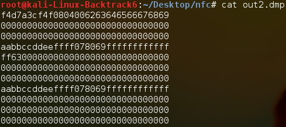
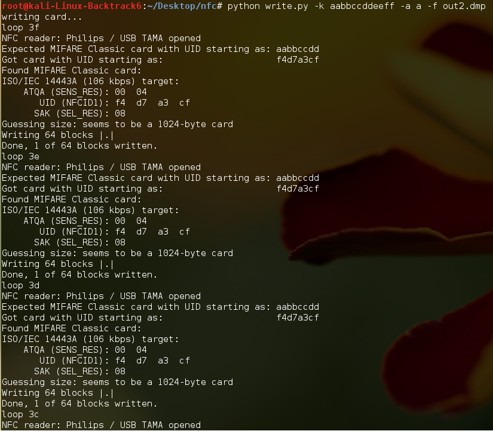
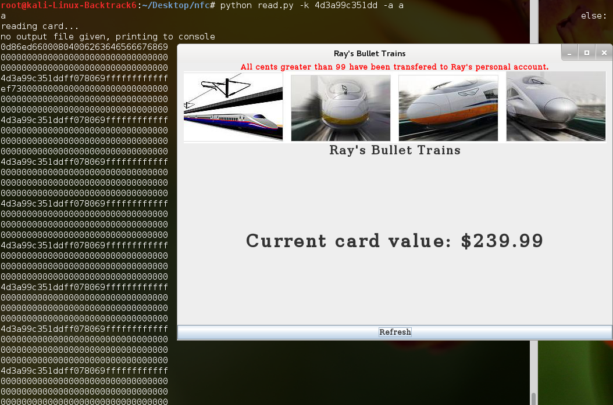

# Lab 04---Smart Cards

## Abstract

Mifare Classic is one of the most dominant forms of proximity cards in
the world, with hundreds of organizations using them for transport
ticketing systems and building access passes. This report makes a quick
overview of the usage and structure of Mifare Classic before looking at
its security, which we find is completely and irreversibly broken.

Since 2009, researchers have publicly disclosed practical attacks that
allow attackers to extract keys and make full clones of any Mifare
Classic card with just a few seconds of physical proximity. With this
information, attackers can ride on public transport for free or gain
access to secure buildings.

No organizations should consider using this broken and outdated protocol
for any application where security is a concern, and organizations
currently using these systems should look to migrate to solutions such
as Mifare DESFire. Although the cards are more expensive and upgrading
the readers and backend systems will require significant organizational
resources, Mifare Classic provides minimal security against any
dedicated attacker, whereas there are currently no known practical
attacks against DESFire.

Security-conscious organizations should also look at pairing smart cards
with a second factor, such as biometrics or a PIN code. Although this
will also have significant costs, the use of two-factor authentication
(2FA) prevents any vulnerabilities in the smart card protocol from
leading to a full breakdown of the security barrier. It should be noted
that although DESFire is seen as secure today, it took over a decade
until the vulnerabilities in Mifare Classic were discovered and
disclosed publicly. Additionally, 2FA also prevents attackers from
simply stealing cards to gain access to secured areas---people are
fallible and may not notice its disappearance for a while or not
immediately contact security when they realize this.

## Introduction

Smartcards are cards containing ICs which can be powered by an
electromagnetic field generated by a compatible reader. This can then
power a low-power chip which can actively communicate with the reader,
transferring data stored on the card and even receive write from the
reader. Today, these are used everywhere, including in passports, credit
cards, bus passes, and building passes.

ISO14433 is an international standard which defines the physical, radio,
and transmission protocols used in contactless proximity cards. One of
the most dominant implementations of this is the Mifare Classic system
that was first introduced in 1994, with over 200 million cards in
circulation as of 2008 [^1]. This report describes the lab in which we
interfaced with these cards in a toy environment and then follows up
with a detailed analysis of its security.

## Experimental Results

Mifare Classic cards are very simple, being essentially just a kilobyte
(or four) of memory alongside some simple logic for authenticating and
encrypting communications with a reader. More advanced versions such as
Mifare DESFire or Mifare SAM contain a full microprocessor supporting
standard ciphers such as DES and AES, although this security comes with
a higher unit cost.

This lab interacts with a few Mifare Classic 1K cards using default
encryption keys, using a NXP PN53x-based card reader to read and write
to the cards. On the software side, we have a Kali Linux VM and a few
simple Python scripts wrapping around the libnfc [^2] library. The
Python scripts only support reading and writing the entire card, and all
blocks must use the same key.

*Table 1: Diagram of Mifare Classic 1K memory layout*

| Sector No.  \  Block No. | 0                            | 1       | 2       | 3 - Sector Trailer           |
| ------------------------ | ---------------------------- | ------- | ------- | ---------------------------- |
| 0                        | Block 0 - Manufacturer Block | Block 1 | Block 2 | Block 3 – sector 0 trailer   |
| 1 <= n <= 14             | 4n                           | 4n + 1  | 4n + 2  | 4n + 3 – sector n trailer    |
| 15                       | 60                           | 61      | 62      | Block 63 - sector 15 trailer |

The 1K card is divided into 16 64-byte sectors, each of which contains 4
blocks. Block 0 is read-only (at least for officially manufactured
cards) and contains a 4-byte NUID or 7-byte UID [^3], alongside other
manufacturer data.

The last block of each sector is the sector trailer block which stores
one (or two) 48-bit access keys, as well as access bits. When both keys
are used, key B always has greater permissions than key A. Every sector
has its own key, and every block in the sector can have different access
permissions. Note that the keys do not encrypt the data; rather, the
reader must prove to the card that they possess the key before the card
will send the block data over an encrypted channel.

*Table 2: Diagram showing byte layout of sector trailer blocks on
Mifare Classic. Note that when sector trailer sectors are read, the
key bytes are zeroed out [^3]*

| Bytes 0-5 | Bytes 6-8   | Byte 9    | Bytes 10-15        |
| --------- | ----------- | --------- | ------------------ |
| Key A     | Access Bits | User Data | Key B OR User Data |

Byte 9 is considered 'part' of the access bits area in terms of access
permissions. If bytes 9 to 15 are used for data, then this means a total
of
`16 sectors * (3 blocks * 16 bytes/block + 1 block * 7 bytes/block) - 16 bytes = 864 bytes`
are available for user data. However, there is no way of giving write
access to these bits without also giving the key write access to the
rest of the sector [^4], which may make this unsuitable in many
circumstances. If sector trailers are not used for data, the data
capacity decreases to 752 bytes.

Each block of the sector has separate access bits. Each has three
logical bits, allowing eight configurations with varying access and key
combinations. The bits are stored twice---once inverted and once
normally. If the card detects an invalid format during a read operation,
that sector becomes permanently bricked. As there is no memory
protection, this can happen rather easily.

Additionally, under five of the eight bit combinations, neither key can
update the access bits, and under four of the eight bit combinations,
neither key can update the keys. Although this may be useful in specific
circumstances, for the purposes of the lab it was definitely not
something we wished to do.

With four blocks each having three bits stored in duplicate, it comes to
a total of 24 bits, 3 bytes or 6 hexadecimal characters. Endianness, as
well as the interleaving and inversion of bits makes manually generating
a valid bit sequence a nightmare. As an incorrect sequence can lead to
the sector being bricked, we used a GUI tool to ensure generated the
correct string.

*Figure 1: Screenshot showing Mifare Access Conditions Calculator app*

The non-trailer blocks support two types of data---read/write blocks and
value blocks. Read/write blocks, as the name suggests, support only read
and write operations, but can store a full 16 bytes of data. In this
lab, data was formatted as read/write blocks---the Python scripts cannot
handle the additional operations available to value blocks, nor can it
even support different keys between blocks.

Value blocks support additional operations such as restore, transfer,
increment, and decrement. In this case, only a 4-byte signed integer can
be stored, with the data being stored in triplicate alongside a 1-byte
address stored in quadruplicate.

The additional operations are useful in cases where you want to only
allow decrementing. For example, the access bits for a block could be
set to 110 which allows key B full permissions but only allows key A to
read and decrement the value [^footnote1]. With this setup, key A could be
used, for example, in bus readers to decrease account balance, while key B
would be used less frequently in a more secure environment to top up
cards. This should, in theory, prevent an attacker from topping up their
card even if they gain access to the card reader on the bus.

The lab used a toy scenario in which Ray's Bullet Trains Ltd. is storing
account balance on Mifare Classic cards using default keys. The account
balance is stored in two bytes on block 4, with the first byte
representing the integer part and the second the fractional part. These
bits were set to `FF 63`, or \$255.99. The key was set to one of the
default keys, `AA B CC DD EE FF`, and the access bits were kept as
`FF 07 80`, which gives full read and write access to all blocks for
both keys.

*Figure 2: Screenshot showing contents of modified dump*

*Figure 3: Screenshot showing card contents being updated*

*Figure 4: Card balance being read by the 'Ray's Bullet Trains' program*

Later in the lab, cards were swapped with another group, and 'cracked'
using a small list of five standard keys. The `crack.py` script would
try the keys one by one in a tiny dictionary attack for both the A and B
keys. With the key determined, we could then go through and update the
balance in the card to `EF 73`, or \$239.115, with the 16 cent
overflow being 'transferred' to Ray's account.

*Figure 5: 'cracking' card from another group*

*Figure 6: Screenshot of balance after update*

It should be noted that much larger dictionaries are available which
contain default and cracked keys---for example, the Mifare Classic Tool
app's GitHub repository contains a list of over 1,000 keys [^5]. If the
key used in the card was unique, a naïve exhaustive search would take
over 40,000 years due to the communication delay between each attempt
[^1]. However, as will be covered below, much, much more efficient
attacks are available.

## Security

The Mifare cards have a three-pass authentication protocol, in which
both the reader and the card must prove that they have knowledge of the
key. In broad strokes:

- The reader sends the sector they want to read and the key they will
  use to read it
- The card sends a challenge---a 32-bit nonce
- The reader solves the challenge (a 64-bit answer) using the key, the
  card UID [^6] and nonce and sends its own nonce. Both are encrypted
  with the keystream
- The card solves the challenge, and sends it encrypted with the
  keystream

However, there are several major issues with the implementation that
make the security useless to any knowledgeable attacker.

ISO14443 is split into four sections, with Mifare Classic only
implementing the first three and opting to use custom and flawed secure
transmission layer [^7]. One of the issues is in the parity bytes used
for error correction are *calculated* over the *plaintext*, but *sent*
*encrypted*. Another issue is that if the parity bits are correct (which
will occur once every 256 times if the message is picked randomly) but
the authentication fails, a 4-bit encrypted error code (whose plaintext
is known) gets sent [^7]. One additional issue is that the same
keystream bit is used to encrypt the parity bit and the first bit of the
next byte of data [^7].

The PRNG, a linear-feedback shift register that makes up the core of the
Crypto-1 cipher, is also an area of weakness. The PRNG state and the
nonce that is chosen by the tag is determined by the time the tag has
been powered on for. As the reader provides the electromagnetic field
that powers the tag, an attacker can control this duration to get the
same nonce each time. This allows an attack where the attacker can
iteratively determine the keystream. Additionally, the PRNG has a 32-bit
length but only a 16-bit state [^7]. [^8] makes a scathing analysis of
this issue, saying that:

> ...This simply means that a large number of logical gates during the
> hardware computation of Crypto-1 are wasted. Identical values are
> computed several times. This seems to contradict the idea that
> Crypto-1 is weak because it was designed by amateurs, or that it is
> weak to make the chip as inexpensive as possible. One can rather get
> the impression, that this cipher was rather carefully designed to look
> much more secure than it actually is, maybe hoping that nobody would
> notice.

If the attacker knows the key for one sector (with [^9] finding that
most cards had at least one sector with a default key), the attacker can
authenticate with that sector and then carry out a nested
authentication. Unlike in a normal authentication, the nonce is
encrypted with the existing keystream. The attacker can control the
timing for this second authentication and hence, predict the nonce.
This, along with other weaknesses, allows the attacker to determine 32
bits of the 48 bit key [^7]. The remaining entropy -- 65,536
combinations -- can be brute forced in less than a second to determine
the correct key.

Even if all keys are unknown, there is another attack described in [^8]
which allows an attacker to determine the key for any sector in about 10
seconds using around 300 authentication attempts. Once this is done, the
nested attack can be used to crack the other sectors.

Hence, an attacker with physical proximity to any Mifare Classic card
can make a full clone of it in 10 seconds or so---for example, an
attacker could sit next to the victim on a bus/subway or simply have a
quick chat with them with their bag or sleeve near their victim's card.
Although sector 0 -- the manufacturer block -- is not writable, many
unlicenced Mifare clones allow this, and Mifare cards can also be
emulated by relatively cheap devices [^9]. With these clones, attackers
can impersonate valid cards, allowing them to get free bus/subway rides
and cause financial losses for transport companies, as was feared with
London's Oyster cards when the vulnerabilities were first released.

Additionally and likely more importantly, cloned cards can be used
impersonate employees, allowing attackers to get physical access to
offices and secured areas to steal intellectual property and gain a
foothold into internal systems for further theft.

Hence, Mifare Classic is completely and irreversibly broken, and
absolutely no one should be looking to begin using Mifare Classic for
anything remotely security or financially sensitive. After the security
issues were disclosed in 2008, even NXP said that they "*do not
recommend the use of Mifare Classic for new installations*" [^10].
Although hardened versions of Mifare Classic are available, these too
were broken in 2015 by [^11].

For any applications requiring security, more costly but much (much)
more secure alternatives such as Mifare DESFire, which contain full
microprocessors supporting DES and AES, are available. However,
organizations with high security requirements should also consider using
two factor authentication (2FA), such as PIN codes or biometrics,
alongside the cards, protecting against vulnerabilities in the protocol
and cards being stolen.

Although DESFire appears to be secure today, it is possible that
vulnerabilities exist and may be known by potential threat actors today.
The issues described above in Mifare Classic, were discovered and
publicly disclosed by researchers more than ten years after release, but
it is likely that some actors, such as nation-states, had the resources
to find these vulnerabilities years before. Additionally (and entering
tinfoil hat territory), it is possible that state actors were even
responsible for some of these 'bugs.' By relying on 2FA, attackers must
have exploits for two dissimilar systems, thereby increasing the
difficulty of bypassing security.

Going back to lower-security applications, organizations with existing
Mifare Classic setups may be stuck with this setup for a while due to
budget concerns---upgrading means not just reissuing all cards, but also
upgrading all the readers and the systems interfacing with the cards,
which is a significant and expensive undertaking.

Although cards can be put in a read-only or decrement-only state to
prevent state restoration attacks (e.g. paying for a subway ride which
decrements the balance, then restoring the card to a previous state) and
preventing the trailer from being modified, attackers can simply buy
blank cards in bulk and make a copy of the card every time they use it,
or simply use an emulator. The only way of detecting this is through
finding discrepancies with the main database whenever the card reader's
state is synchronized with the database. However, given the recent rise
in IoT and ubiquitous networking, it may be possible to make all readers
fully online, allowing the card balance to be looked up through a
central database.

Unfortunately, this will not prevent attackers from simply cloning other
people's cards. This can be detected, but not fully stopped. For
example, [^4] proposes having a monotonically increasing counter, the
reader incrementing the value on every read and synchronizing the state
to a central database. If the counter state is repeated, this can be
detected and the card (both cards---there is no practical way to tell
which one is the 'real' one) can be blacklisted. The counter-UID pair
should be authenticated with an HMAC, thereby preventing an attacker
from guessing how many times the victim has used the card since the
cloning and updating the card value accordingly.

## Conclusions

This report looked at the implementation and security of Mifare Classic
and finds it to be completely broken. Attacks have been publicly
disclosed for over a decade allow attackers to crack keys for any and
all sectors and extract the full contents of the card after just a few
seconds of physical proximity. With this information, attacks can make
state restoration attacks, causing financial damage to transport
companies, and allow attackers to clone cards and access secured
buildings.

There is no way of preventing these attacks; organizations that continue
to use Mifare Classic for whatever reason can only mitigate the
consequences. For example, backend checks could be used to find and
blacklist cards where there are discrepancies between the card state and
the database.

Wherever possible, organizations should move to more secure solutions
such as Mifare DESFire. This standard currently has no publicly
disclosed, practical attacks, giving organizations some confidence in
their security. However, this security is useless if an attacker simply
steals the cards and hence, security-conscious organizations should look
at pairing proximity cards with a second factor such as biometrics or a
PIN code (the latter being used by UC for building access during
off-hours). The use of a second factor prevents card theft alone from
granting access and provides organizations with a security buffer if
practical attacks against DESFire are found today or in the future.

[^footnote1]: Technically, a decrement command saves the result to a
temporary register, after which a transfer command can be used to
update the block. However, if there are other value blocks in the same
sector, the values can be transferred between blocks. This could be
detected if each block in the sector has a different address; however,
if those blocks have write access using the same key, the address could
be modified before doing the transfer, making this undetectable [^12].
Hence, care must be taken to ensure that the same key cannot
be used to restore/transfer from other blocks in the same sector.

[^1]: G. d. K. Gans, J.-H. Hoepman and F. D. Garcia, "A Practical Attack on the MIFARE Classic," in *CARDIS: International Conference on Smart Card Research and Advanced Applications*, London, UK, 2008.

[^2]: nfc-tools, "nfctools," \[Online\]. Available: https://github.com/nfc-tools/libnfc. \[Accessed 2022-04-04\].

[^3]: NXP Semiconductors, "MF1S50YYX_V1 Data Sheet Rev. 3.2," 2018-03-23. \[Online\]. Available: https://www.nxp.com/docs/en/data-sheet/MF1S50YYX_V1.pdf. \[Accessed 2022-04-02\].

[^4]: W. Teepe, "Making the Best of Mifare Classic," 2008-10-06. \[Online\]. Available: https://citeseerx.ist.psu.edu/viewdoc/download?doi=10.1.1.511.7146&rep=rep1&type=pdf. \[Accessed 2022-04-06\].

[^5]: G. Klostermeier, "extended-std.keys," 2022-02-17. \[Online\]. Available: https://github.com/ikarus23/MifareClassicTool/blob/master/Mifare%20Classic%20Tool/app/src/main/assets/key-files/extended-std.keys.  \[Accessed 2022-04-06\].

[^6]: P. Lupták, "Mifare Classic analysis in Czech Republic / Slovakia," Nethemba, \[Online\]. Available: https://nethemba.com/resources/mifare-classic-slides.pdf. \[Accessed 2022-04-02\].

[^7]: F. D. Garcia, P. van Rossum, R. Verdult and R. W. Schreur, "Wirelessly Pickpocketing a Mifare Classic Card," Radboud University Nijmegen, 2009. \[Online\]. Available: https://www.cs.ru.nl/\~flaviog/publications/Pickpocketing.Mifare.pdf. \[Accessed 2022-04-06\].

[^8]: N. Courtois, "THE DARK SIDE OF SECURITY BY OBSCURITY," University College London, 2009. \[Online\]. Available: https://eprint.iacr.org/2009/137.pdf. \[Accessed 2022-04-03\].

[^9]: P. Lupták, "Nethemba Public Security Research Projects (2007-2015)," Nethemba, 2016-05-17. \[Online\]. Available: https://www.nethemba.com/cs/nethemba-public-security-research-projects-2007-2015/. \[Accessed 2022-04-05\].

[^10]: P. Price, "Oyster card hack details revealed," BBC Click, 2008-10-06. \[Online\]. Available: http://news.bbc.co.uk/1/hi/programmes/click_online/7655292.stm. \[Accessed 2020-04-06\].

[^11]: C. Meijer and R. Verdult, "Ciphertext-only Cryptanalysis on Hardened Mifare Classic Cards," Radboud University, 2008. \[Online\].  Available: http://cs.ru.nl/\~rverdult/Ciphertext-only_Cryptanalysis_on_Hardened_Mifare_Classic_Cards-CCS_2015.pdf. \[Accessed 2022-04-07\].

[^12]: W. Teepe, "Making the Best of Mifare Classic Update," 2008-12-11. \[Online\]. Available: https://citeseerx.ist.psu.edu/viewdoc/download?doi=10.1.1.618.6083&rep=rep1&type=pdf. \[Accessed 2022-04-04\].

<!--
-   Nethemba eample 16 keys known

In addition to this suspicious hardware, there

-   Nethemba:

    -   Nested attack: if the key for one block is known, a nested
        attack can be carried out

        -   Random number generator, LFSR, has clock running at known
            frequency, and gets initialized to the same value after
            every boot

        -   In a nested attack, can authenticate to the same block to
            read the tag nonce, which is generated from the LFSR. Timing
            can be controlled by attacker so internal state can be
            guessed?

    -   Parity bit encrypted, but does not 'consume' keystream bit:
        first bit of next encrypted byte uses the same keystream bit

In some industries algorithm secrecy is indispensable. For example it
very hard and costly to protect smart cards against side channel
attack... Of course, secrecy is a good idea only if these algorithms are
good in the first place. Otherwise we are creating an illusion of
security which can be as bad or worse than having no security at all.

Fact 4.2.2 *The card answers with a 4-bit encrypted NACK if and only if
the parity bits for the plaintext after decryption are correct.*

<http://news.bbc.co.uk/1/hi/programmes/click_online/7655292.stm>

<https://www.nethemba.com/cs/nethemba-public-security-research-projects-2007-2015/>

Nethemba: "decrement counter" (initially set to 0xffffffff), keys A/B
have permissions only for decrementing counter and cannot be changed,
content of card (with passenger credit) is encrypted/hashed with card
UID, decrement counter and private key

<https://www.nxp.com/docs/en/data-sheet/MF1S50YYX_V1.pdf>

ISO14443

3 pass Authentication:

-   Two keys, A and B, with separate bit flags for each

-   Reader picks sector and key to read

-   Card sends challenge -- 32 bit nonce, and UID

-   Reader solves challenge using key and number -- 8 byte answer

-   Reader sends response and its own challenge

-   Card solves reader challenge and responds

-   Subsequent transmissions encrypted with that key

<https://link.springer.com/content/pdf/10.1007%2F978-3-540-85893-5_20.pdf>
sniff one authenticated transaction with known plaintext (e.g. keys 0,
manufacturer data )

In nested authentication

-   In single auth tag sends UID and tag nonce unencrypted

-   In nested auth tag nonce is sent encrypted

-   Parity bit computed over plaintext but sent encrypted, first bit of
    next data byte also encrypted with the same keystream bit

    -   Each byte leaks one bit of information about plaintext

<https://www.cs.ru.nl/~flaviog/publications/Pickpocketing.Mifare.pdf>

-   Mifare has custom secure communication layer (ISO14443-A 1-3, but
    not part 4)

-   In auth, different response from card

    -   Wrong parity bit: stop communication

    -   Correct parity, wrong authentication data: encrypted error code

        -   4-bit code. Plaintext code is known

        -   If successful, 12/48 bits of entropy leaked. Repeat 6 times,
            brute force. 6 \* 256 = 1500 auth attempts, \< 1second

    -   Nested auth leaks 32 bits of secret key

-   PRNG period 16 bits = 618ms

-   Attacker can turn off field to discharge capacitors, then turn it on
    again to reset the PRNG state

    -   If timing controlled, can control tag challenge nonce

    -   Repeat until correct parity bits guessed

    -   Then flip the last bit of encrypted reader nonce -- parity but
        must flip. Can use this to determine if last bit of nonce
        influences encryption of next bit (reader nonce entered into
        stream cipher state)

    -   Repeat for second to lsast byte.

    -   Try find nonce with some certain properties -- 285000 auth
        attempts on avg.

-   Stream cipher initial state: sector key

    -   Then tag nonce XOR uid shifted in, then reader nonce shifted in

    -   In nested authentication, cipher state initialized to key of new
        sector

        -   Tag nonce also encrypted; attacker can try guess the 16-bit
            nonce. 3 bits of information leaked, so 2\^13. Timing
            information also allows challenge nonce to be predicted

    -   

<https://nethemba.com/resources/mifare-classic-slides.pdf>

PRNG: polynomial. Clock tick + counter used as input

Challenge: cipher using key, UID and nonce

Nested attack: authenticate block with default key to determine Nt (tag
nonce) generated by the LFSR. Read again, get different nonce Nt'.
Determine timing distance -- num iterations of the LFSR. Guess NT using
these values

<https://security.stackexchange.com/questions/107450/how-mifare-classic-nested-attack-works>

Nested read -- LFSR state usually gets reset, but under nested read
state remains? During auth, reader must return parity bits (parity bits
computed over plaintext but ) in addition to answering the challenge --
different error message depending on if parity bits or challenge are
wrong. 1/256 chance of parity bits being correct, which leaks 12/48 bits
of entropy.

Commands: read/write/decrement/increment/restore (to buffer)/transfer
(from buffer)

-   16 bit CRC/block

-   Parity bit per byte

-   1024 bytes of memory

    -   16 sectors of 4 blocks each

    -   16 bytes per block

        -   Sector trailer

            -   6 bytes of data per block for each key

            -   4 bytes of access bits per block

Sector 0, Block 0: manufacturer block. Write protected. Either 4 byte
NUID (non-unique identifier) or 7 byte UID. Remaining bytes in the block
undefined.

Data blocks:

-   Read/write blocks: 16 bytes of data

-   Value block:

    -   4 bytes of data: twice normally, once inverted. All commands
        supported

    -   Adr: 1-byte address, stored twice inverted and twice normally.
        Can only be altered by write-only

Sector trailer:

-   Last block (block 3) of each sector

    -   Contains secret key A, optionally B; key reads all zeroes

    -   6 byte key A, 4 bytes access bits, 6 bytes key B

        -   That is, a 48 bit key

    -   Last byte (byte 9) of the access bits can optionally be used for
        use data

    -   If key B not used, can be used for data

    -   Access bits

        -   3 bytes determine if each block can be read/written to by
            each key

        -   Bits stored inverted and non-inverted

        -   3 bits \* 2 stores/bit \* 4 blocks = 3 bytes = 6 hexadecimal
            characters

        -   \~\~3 bits determine if the sector trailer can be
            read/written to by key A/B

        -   3 more bits to determine permissions for each key for the
            data blocks in the sector

            -   Read, write, increment, decrement\~\~

<https://github.com/nfc-tools/mfcuk>

<https://eprint.iacr.org/2009/137.pdf>

<https://www.researchgate.net/publication/221436521_The_Dark_Side_of_Security_by_Obscurity_-_and_Cloning_MiFare_Classic_Rail_and_Building_Passes_Anywhere_Anytime>

<https://www.cs.bham.ac.uk/~garciaf/publications/Dismantling.Mifare.pdf>

-   The second and more efficient attack uses a cryptographic weakness
    of the CRYPTO1 cipher allowing us to recover the internal state of
    the cipher given a small part of the keystream. To mount this
    attack, one only needs one or two partial authentication from a
    reader to recover the secret key within one second, on ordinary
    hardware. This attack does not require any pre-computation and only
    needs about 8 MB of memory to be executed.

-   Therefore the nonce it generates only depends on the time between
    power up and the start of communication \[NP07\]. Since we control
    the reader, we control this timing and therefore can get the same
    tag nonce every time

-   In particular, the second attack recovers a secret key from just one
    or two authentication attempts with a genuine reader (without access
    to a genuine tag) in less than a second on ordinary hardware and
    without any pre-computation. Furthermore, an attacker that is
    capable of eavesdropping the communication between a tag and a
    reader can recover all keys used in this communication. This enables
    an attacker to decrypt the whole trace and clone the tag.

-   

<https://www.sciencedirect.com/science/article/pii/S0895717712002038>

In this paper, we have proposed a legitimate-reader-only attack on
MIFARE Classic for the first time, where an adversary only communicates
with a genuine reader. We find that the key of the second or subsequent
sectors in a nested authentication can be recovered just by wireless
eavesdropping on the communication between a genuine reader and an
emulator, ProxMark. Specifically, the attackers only attempt 8
authentications on average, negligible online time, and the off-line
search takes under 328 s to recover the key of the second sector on
Garcia's ordinary computer

-->
